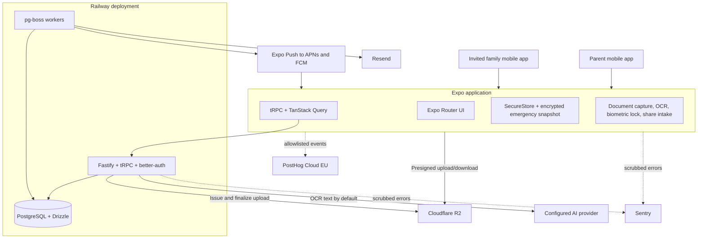
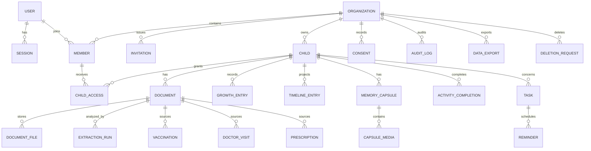
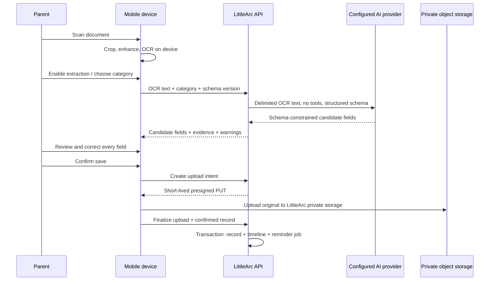
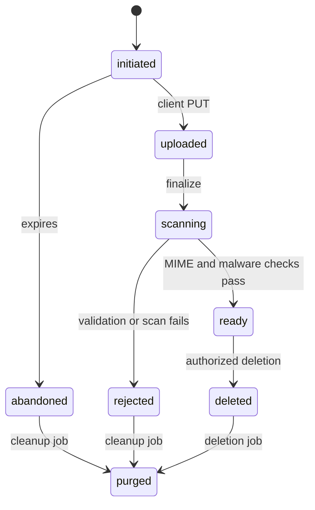

# LittleArc Mobile Architecture and Tech Stack

**Status:** Final architecture baseline for MVP implementation  
**Last reviewed:** 2026-07-13  
**Product scope:** [LittleArc Product Plan](./plan.md)

---

## 1. Executive Summary

LittleArc will be a mobile-only TypeScript application built with React Native and Expo for iOS and Android. Native apps are compiled locally; EAS Build, EAS Submit, and EAS Update are not used for the MVP.

The backend is a modular Fastify application exposing a private tRPC API. Authentication, sessions, households, invitations, and fixed role templates are provided by better-auth using the same PostgreSQL database as the product. Drizzle owns the application schema and migrations. Private files are stored through an S3-compatible adapter backed by MinIO locally and Cloudflare R2 in production.

The Health and Document Vault is the deepest MVP surface. Smart Capture uses native document scanning and on-device OCR. Only OCR text is sent to the backend's provider-neutral AI extraction service by default. A parent must review and confirm extracted values before they become health records, timeline entries, or reminders. Sending an image to a vision model is a separate, explicit per-document action.

The architecture deliberately minimizes infrastructure:

- One mobile codebase for both platforms.
- One deployable API codebase that can run API and worker roles together at low scale, then split without refactoring.
- PostgreSQL for relational data, search, authorization context, and background jobs.
- S3-compatible storage behind an adapter to preserve self-hosting portability.
- No Redis, Elasticsearch, WebSocket service, managed sync engine, or payment service in the MVP.

---

## 2. Architecture Decisions

| Area | Decision | Notes |
| --- | --- | --- |
| Mobile | React Native + latest stable Expo SDK at bootstrap | Pin exact versions; current Expo releases require the New Architecture |
| Navigation | Expo Router | File-based routes, native stacks, five bottom tabs |
| Native builds | Local `expo run:ios` / `expo run:android` | No EAS Build |
| Native generation | Expo Prebuild / CNG + app-owned config plugins | Run `expo prebuild --clean`; do not hand-edit generated native projects |
| Releases | Local Fastlane + Xcode/Gradle | No EAS Submit or OTA updates |
| API | Fastify + tRPC + Zod | Private TypeScript mobile client only |
| Runtime | Current Node.js LTS, minimum Node 22.12 | Pin in `.node-version` and `package.json` engines |
| Authentication | better-auth + Expo plugin | Email/password, Google, Apple, secure cookie storage |
| Household access | better-auth organization plugin + static custom access control | Fixed MVP roles; dynamic custom roles deferred |
| Database | PostgreSQL + Drizzle ORM | Relational source of truth and full-text search |
| Tenant isolation | Server authorization + PostgreSQL RLS | Both are required before production launch |
| Background work | pg-boss | Same PostgreSQL; jobs can be enqueued transactionally |
| Object storage | MinIO local, Cloudflare R2 production | Private buckets and short-lived presigned URLs |
| Transactional email | Mailpit local, Resend production | Invitations, verification, reset, generic reminder backup |
| Push | `expo-notifications` + Expo Push Service | Works with local builds; adapter allows direct APNs/FCM later |
| AI | Vercel AI SDK 7 provider adapters | Server-side only; model/provider selected by configuration |
| Analytics | PostHog Cloud EU | Strict allowlist; no child, health, document, or contact data |
| Error monitoring | Sentry | PII disabled and payloads scrubbed |
| Offline | Encrypted, read-only emergency snapshot | No general offline write queue in MVP |
| Payments | Disabled | `PAYWALL_ENABLED=false`; RevenueCat considered later |
| Repository | pnpm workspace + Turborepo + Biome | Shared contracts and configuration |

### 2.1 Explicit non-decisions

- No client-side end-to-end file encryption in the MVP. Provider encryption at rest, TLS, access controls, and private storage are required. E2E encryption remains Phase 1.5.
- No real-time subscriptions in the MVP. Shared views refresh on mutation, app foreground, pull-to-refresh, and normal query invalidation.
- No home-screen widget in the MVP. It is a fast-follow feature after the offline emergency screen is stable.
- No model vendor is hard-coded. An allowlisted provider and model are selected through server configuration.
- No custom role builder in the MVP. Roles are fixed, explainable templates.

---

## 3. Quality Attributes

Architecture trade-offs are evaluated in this order:

1. **Privacy and tenant isolation.** A household must never read another household's data. Health and child content must not leak into logs, analytics, notifications, or AI requests.
2. **Recoverability.** Documents, memories, and health records need tested backups and deliberate deletion workflows.
3. **Correctness.** AI output is untrusted input. No extracted value creates a health record or reminder without parent confirmation.
4. **Fast retrieval.** The emergency card must open offline in two taps after local device authentication.
5. **Low operational load.** The initial system avoids infrastructure that a small team cannot operate confidently.
6. **Portability.** Core services run in containers, PostgreSQL, and an S3-compatible store so Railway and R2 can be replaced later.
7. **Backward compatibility.** Installed mobile binaries may remain old for weeks, so API evolution is additive and version-gated.

### 3.1 Initial service objectives

These are engineering targets, not public guarantees:

| Measure | MVP target |
| --- | --- |
| Offline emergency-card open | Under 1 second after device authentication |
| API availability | 99.5% monthly, excluding planned maintenance |
| Normal API latency | p95 under 500 ms, excluding AI and file transfer |
| Smart Capture extraction | p95 under 12 seconds after OCR text reaches the API |
| Reminder job start | Within 5 minutes of scheduled processing time |
| Database recovery point | 24 hours or better |
| Database recovery time | 4 hours or better |
| Timeline scrolling | 60 FPS target on a representative mid-range Android device |

Push providers do not guarantee delivery. The in-app reminder list is the source of truth; push and email are delivery channels.

---

## 4. System Context



### 4.1 Production deployables

| Deployable | Initial mode | Scale-out mode |
| --- | --- | --- |
| `mobile` | Local signed iOS/Android binaries | Unchanged |
| `api` | One Railway service running HTTP + workers | Separate `api` and `worker` services using different start commands |
| `postgres` | Railway PostgreSQL in Singapore | Larger managed instance or self-hosted PostgreSQL |
| `object-store` | Cloudflare R2 private buckets | Any S3-compatible provider or self-hosted MinIO |
| `clamav` | Small private scanner service for PDFs and files | Dedicated scanner pool if upload volume grows |

Singapore is the preferred Railway region for the Indian audience. This is a latency choice, not an India data-residency claim. Data residency and cross-border processing must be reviewed before launch.

---

## 5. Repository Layout

```text
.
├── apps/
│   ├── mobile/
│   │   ├── app/                    # Expo Router routes
│   │   ├── src/
│   │   │   ├── features/           # profile, vault, timeline, memory, activities, family
│   │   │   ├── components/
│   │   │   ├── lib/                # auth client, tRPC, analytics, error reporting
│   │   │   ├── offline/            # emergency snapshot adapter
│   │   │   └── native/             # typed interfaces for local native modules
│   │   ├── modules/
│   │   │   ├── document-capture/   # local Expo Module: scanner + OCR adapters
│   │   │   └── share-intake/       # local config plugin/native target integration
│   │   ├── app.config.ts
│   │   └── fastlane/               # kept outside generated ios/android folders
│   └── api/
│       ├── src/
│       │   ├── server.ts            # Fastify HTTP entrypoint
│       │   ├── worker.ts            # pg-boss worker entrypoint
│       │   ├── all.ts               # low-cost API + worker process entrypoint
│       │   ├── routers/             # tRPC routers by product module
│       │   ├── auth/                # better-auth and permission definitions
│       │   ├── services/            # storage, notifications, email, AI, exports
│       │   ├── jobs/                # reminder, receipt, cleanup, export, deletion jobs
│       │   └── plugins/             # Fastify plugins and request context
│       └── Dockerfile
├── packages/
│   ├── contracts/                   # shared Zod schemas, enums, mobile-safe DTOs
│   ├── db/                          # Drizzle schema, migrations, repositories
│   ├── api-types/                   # type-only AppRouter export; no server runtime exports
│   ├── observability/               # redaction and event allowlists
│   └── config/                      # TypeScript and Biome configuration
├── tooling/
│   ├── docker/                      # MinIO and local service initialization
│   └── scripts/                     # backup, restore, release, fixture utilities
├── docker-compose.yml               # PostgreSQL, MinIO, Mailpit, ClamAV
├── pnpm-workspace.yaml
├── turbo.json
├── Gemfile                          # pinned Fastlane via Bundler
└── .node-version
```

The mobile app imports the tRPC router as a **type-only** dependency. Server implementations and secrets must never enter the Metro dependency graph.

---

## 6. Environment Strategy

Use three isolated environments:

| Environment | Purpose | Data rule |
| --- | --- | --- |
| Local | Development and integration tests | Synthetic data only |
| Staging | Store/internal testing and release validation | Synthetic or explicitly consented test data only |
| Production | Real households | Production credentials and retention controls |

Each environment has distinct:

- Bundle/application IDs and deep-link schemes.
- better-auth secrets and base URLs.
- Google and Apple OAuth clients.
- PostgreSQL databases.
- R2 buckets and API tokens.
- Resend domains/API keys.
- Sentry projects/environments.
- PostHog project keys.
- AI provider keys and model allowlists.

Recommended identifiers:

```text
Production iOS/Android: com.littlearc.app
Staging iOS/Android:    com.littlearc.app.staging
Production deep link:   littlearc://
Staging deep link:      littlearc-staging://
```

Secrets live in local untracked environment files or Railway secret variables. No provider key, database URL, S3 secret, signing key, or service-account JSON may be embedded in the app bundle or committed.

---

## 7. Mobile Application Architecture

### 7.1 Route structure

```text
app/
├── (auth)/
│   ├── sign-in.tsx
│   ├── sign-up.tsx
│   ├── verify-email.tsx
│   └── accept-invite.tsx
├── onboarding/
│   └── child.tsx
├── (tabs)/
│   ├── today/
│   ├── timeline/
│   ├── vault/
│   ├── activities/
│   └── family/
├── capture/
│   ├── scan.tsx
│   ├── extract.tsx
│   ├── review.tsx
│   └── save.tsx
├── emergency.tsx
└── settings/
```

The emergency screen is reachable from the authenticated app shell in two taps and must not depend on a network request.

### 7.2 State ownership

| State | Owner |
| --- | --- |
| Server data | tRPC + TanStack Query |
| Form state | React Hook Form + Zod resolver |
| Auth session/cookies | better-auth Expo client + Expo SecureStore |
| Selected child and capture draft | Small Zustand store only if cross-route state is required |
| Offline emergency snapshot | `EmergencySnapshotStore` abstraction backed by encrypted MMKV |
| Navigation state | Expo Router |

Do not duplicate server records into a global client store. Query invalidation follows successful mutations.

### 7.3 Offline emergency snapshot

Only the minimum emergency payload is persisted:

```ts
type EmergencySnapshot = {
  schemaVersion: number;
  childId: string;
  displayName: string;
  dateOfBirth: string;
  bloodGroup: string | null;
  allergies: string[];
  criticalNotes: string | null;
  emergencyContacts: Array<{ name: string; relationship: string; phone: string }>;
  pediatrician: { name: string; phone: string } | null;
  serverVersion: number;
  refreshedAt: string;
  expiresAt: string;
};
```

Implementation rules:

- MMKV uses a random encryption key stored in SecureStore, not a hard-coded key.
- Refresh after profile mutation, successful sign-in, household/child switch, and each online app foreground.
- Show `refreshedAt` on the emergency screen so stale data is visible.
- Owners/parents may retain the snapshot for 30 days; non-parent assigned caregivers receive a 7-day expiry.
- Membership revocation sends a best-effort cache-clear notification and invalidates online access immediately. An offline revoked device may retain the snapshot until expiry; this limitation is disclosed to owners.
- Sign-out, child removal, membership removal, and account deletion clear the local snapshot.
- General timeline, vault, and memory caches are not persisted for offline use in the MVP.

### 7.4 Biometric app lock

- Use `expo-local-authentication` for Face ID/fingerprint/device authentication.
- Use the device credential as fallback; do not invent a separate app passcode in the MVP.
- Lock on cold start and after a configurable background timeout, initially 30 seconds.
- Blur sensitive screens in the app switcher. On Android, use `FLAG_SECURE` for vault/document screens; on iOS, cover content while inactive.
- The app lock is a local privacy gate, not an authentication boundary. Server authorization is always required.
- If biometric enrollment changes and a protected local key becomes invalid, clear the offline snapshot and require online sign-in to recreate it.

### 7.5 Native document capture

Smart Capture requires an app-owned native abstraction:

```ts
interface DocumentCapture {
  scan(options: { maxPages: number; allowGallery: boolean }): Promise<ScannedPage[]>;
  recognizeText(page: ScannedPage, languages: string[]): Promise<OcrResult>;
}
```

Platform implementations:

- **iOS:** VisionKit document camera for edge detection/crop and Apple Vision text recognition.
- **Android:** Google ML Kit Document Scanner and Text Recognition v2.
- **Android fallback:** `expo-camera` plus manual crop on devices without compatible Google Play services.

This code lives in a local Expo Module/config plugin instead of making a community wrapper a permanent architecture dependency. A time-boxed native feasibility spike must pass on the pinned Expo SDK before feature work starts.

Initial OCR support is English/Latin and Hindi/Devanagari. Other Indian scripts require the manual path or explicit-consent vision fallback until device support is verified. The UI must never imply unsupported-language accuracy.

### 7.6 Incoming share sheet

The MVP receives images and PDFs from WhatsApp, gallery, Files, and email:

- iOS uses a Share Extension and App Group generated by an app-owned config plugin.
- Android uses share intent filters and a native handoff module.
- The extension copies the file into an app-private temporary inbox and opens the main app.
- The extension does not perform auth, AI calls, or long-running uploads.
- If the user is signed out, the main app requires sign-in before import review.
- Unclaimed temporary files are deleted after 24 hours.

The home-screen widget is not part of this native target work and remains fast-follow.

### 7.7 Rendering and performance

- Enable Hermes and use the Expo-required React Native New Architecture.
- Use FlashList or another virtualized list for Timeline and large Vault lists.
- Use `expo-image` for cached image rendering and thumbnails.
- Keep document previews and media decoding off the JS thread where native APIs allow it.
- Do not add memoization speculatively; profile first with React Native DevTools and native profilers.
- Test startup, capture, timeline scroll, and memory use on a representative mid-range Android physical device, not only an iOS simulator.
- Verify every native dependency supports Android 16 KB page sizes before Play submission.

---

## 8. Backend Architecture

### 8.1 HTTP surfaces

| Path | Purpose |
| --- | --- |
| `/api/auth/*` | better-auth handlers |
| `/trpc/*` | Private product API |
| `/mobile-config` | Stable, unauthenticated app compatibility/config endpoint |
| `/links/*` | Minimal HTTPS mobile-link gateway for invitations and account emails |
| `/.well-known/*` | Apple universal-link and Android app-link association files |
| `/health/live` | Process liveness only |
| `/health/ready` | Database and required dependency readiness |

File bytes never pass through tRPC. The API creates upload intents and presigned URLs; the client transfers files directly to object storage.

### 8.2 Fastify composition

```text
Fastify
├── request ID and structured logging
├── security headers
├── trusted proxy configuration
├── rate limits
├── better-auth handler
├── tRPC adapter
│   └── context: session, member, organization, app build, request ID
├── mobile-config route
└── health routes
```

Use Pino's built-in redaction for cookies, authorization headers, presigned URLs, emails, OCR text, AI prompts, health fields, and document metadata.

### 8.3 tRPC router boundaries

```text
appRouter
├── profile
├── timeline
├── vault
│   ├── uploads
│   ├── extraction
│   ├── vaccinations
│   ├── visits
│   ├── prescriptions
│   └── growth
├── memories
├── activities
├── family
├── reminders
├── exports
└── account
```

Each protected procedure declares a required domain permission and receives a tenant-scoped database transaction. Routers do not query Drizzle tables directly; repositories require `organizationId` and, for child data, `childId`.

### 8.4 Error contract

- Return stable tRPC error codes such as `UNAUTHORIZED`, `FORBIDDEN`, `NOT_FOUND`, `CONFLICT`, `BAD_REQUEST`, `TOO_MANY_REQUESTS`, and `PRECONDITION_FAILED`.
- Do not expose SQL, provider, stack, model, bucket, or internal path details.
- Include a safe user message and request ID.
- AI and storage provider errors map to retryable/non-retryable application errors.

---

## 9. Mobile/API Compatibility

tRPC gives compile-time compatibility inside the monorepo but does not protect already-installed binaries. The following runtime strategy is required.

Every request includes:

```text
x-app-platform: ios | android
x-app-version: 1.4.0
x-app-build: 10400
x-request-id: <uuid>
```

Use monotonically increasing platform build numbers for comparisons; do not compare semantic version strings lexicographically.

`GET /mobile-config` returns a stable JSON document independent of tRPC:

```json
{
  "ios": {
    "minimumBuild": 10400,
    "latestBuild": 10500,
    "storeUrl": "https://apps.apple.com/..."
  },
  "android": {
    "minimumBuild": 10400,
    "latestBuild": 10500,
    "storeUrl": "https://play.google.com/..."
  },
  "maintenance": false
}
```

Compatibility rules:

- Add procedures and optional fields; do not rename or remove fields used by supported builds.
- Use expand/backfill/contract database migrations.
- Keep at least two public app releases compatible, normally for at least 90 days.
- A build below `minimumBuild` receives HTTP 426 for protected network operations and a blocking store-update screen.
- The blocking update screen must still allow access to the valid offline emergency snapshot.
- Soft updates are dismissible. Hard updates are limited to security, data-integrity, or unavoidable API compatibility incidents.
- Because there is no OTA, all JavaScript and native fixes ship through App Store and Play Store releases.

---

## 10. Authentication and Authorization

### 10.1 better-auth integration

Server plugins:

- Drizzle PostgreSQL adapter.
- Expo plugin.
- Organization plugin.
- Static custom access control.

Client plugins:

- Expo client using SecureStore for session cookies.
- Organization client using the same static role definitions.

The Expo client retrieves the better-auth cookie from SecureStore and attaches it to the tRPC batch link's `Cookie` header. Production trusted origins contain only exact LittleArc schemes and HTTPS hosts. Development wildcard origins are never enabled in production.

### 10.2 Sign-in methods

- **Email/password:** email verification required; password reset via Resend; generic responses prevent account enumeration.
- **Google:** better-auth browser OAuth initially; native ID-token exchange can replace it later without changing account ownership.
- **Apple:** native `expo-apple-authentication` on iOS, then better-auth ID-token verification. State and nonce are required. The Apple capability and entitlement are configured manually because EAS Build is not used.

Social accounts with the same verified email are linked only through better-auth's documented safe account-linking flow. Never link accounts based on unverified client input.

### 10.3 Mobile email links

Email verification, password reset, and household invitations use HTTPS links on a dedicated domain such as `links.littlearc.app`, not bare custom-scheme URLs.

- Configure Apple Universal Links and Android App Links.
- Serve `apple-app-site-association` and `.well-known/assetlinks.json` from the API/link domain.
- If the app is installed, the link opens the correct authenticated app route.
- If the app is absent, a minimal non-product page sends the user to the appropriate store while preserving a short-lived action token.
- Invitation acceptance requires a signed-in session whose verified email matches the invitation.
- Invitation IDs/tokens are action-capable secrets: short-lived, single-use, redacted from logs, and never sent to analytics.

This gateway is infrastructure for mobile authentication and invitations, not a web companion product.

### 10.4 Household model

A better-auth organization represents a household. A user can belong to multiple households, although the MVP UI centers one active household. The client may request an active household, but the server always verifies current membership.

Dynamic custom roles are disabled for MVP. Static roles are shared between server and client for UI decisions, but only server checks grant access.

### 10.5 Role and visibility matrix

| Capability | Owner | Parent | Grandparent | Guardian/nanny |
| --- | --- | --- | --- | --- |
| View assigned child's emergency card | Yes | Yes | Yes | Yes |
| View full health vault | Yes | Yes | No by default | No by default |
| Create/edit health records | Yes | Yes | No | Only explicitly shared care notes |
| View family memories | Yes | Yes | Yes for assigned child | No by default |
| Add memory contribution | Yes | Yes | Yes for assigned child | No by default |
| View/complete assigned tasks | Yes | Yes | Yes | Yes |
| Add handover notes | Yes | Yes | No | Yes |
| Invite grandparent/guardian | Yes | Yes | No | No |
| Change roles or remove members | Yes | No | No | No |
| Export child/household data | Yes | Yes for assigned child | No | No |
| Delete child/household | Yes | No | No | No |

`child_access` assigns non-owner members to specific children. Sensitive records use a small visibility enum:

```text
parents     # owner and parent only
care_team   # parents plus assigned guardian when explicitly shared
family      # parents plus assigned grandparents
```

Health documents default to `parents`, emergency information to assigned care-team access, and memories to `family`. Future-unlock letters remain `parents` until unlocked.

### 10.6 Authorization enforcement

Authorization has three layers:

1. better-auth verifies the session and organization membership.
2. Domain authorization checks role, child assignment, action, and record visibility.
3. PostgreSQL RLS restricts every tenant table to the request's organization as defense in depth.

Domain procedures run inside a transaction that sets local database context:

```sql
SET LOCAL app.organization_id = '<verified-organization-id>';
SET LOCAL app.user_id = '<verified-user-id>';
```

Representative RLS policy:

```sql
ALTER TABLE children ENABLE ROW LEVEL SECURITY;
ALTER TABLE children FORCE ROW LEVEL SECURITY;

CREATE POLICY children_tenant_isolation ON children
  USING (
    organization_id = nullif(current_setting('app.organization_id', true), '')::uuid
  )
  WITH CHECK (
    organization_id = nullif(current_setting('app.organization_id', true), '')::uuid
  );
```

Application runtime database roles must not have `BYPASSRLS`. Migration/admin credentials are separate. Worker jobs set verified organization context per job. Cross-household maintenance uses a separate, narrowly controlled maintenance role and produces audit events.

Every protected procedure has automated horizontal and vertical authorization tests.

---

## 11. Data Architecture

### 11.1 Entity overview



### 11.2 Table groups

**better-auth owned**

- `user`, `session`, `account`, `verification`
- `organization`, `member`, `invitation`

**identity and access**

- `children`
- `child_access`
- `emergency_contacts`
- `clinicians`
- `consents`

**vault and health**

- `upload_intents`
- `documents`
- `document_files`
- `extraction_runs`
- `vaccinations`
- `doctor_visits`
- `prescriptions`
- `growth_entries`

**timeline and memories**

- `timeline_entries`
- `memory_capsules`
- `capsule_media`
- `future_unlocks`

**activities and coordination**

- `activities` (global curated catalog)
- `activity_completions`
- `tasks`
- `handover_notes`
- `reminders`
- `notification_deliveries`

**operations and privacy**

- `device_installations`
- `push_tokens`
- `audit_logs`
- `data_exports`
- `deletion_requests`
- `storage_usage`

### 11.3 Schema conventions

- Use opaque UUIDs generated by the application.
- Every tenant-owned row includes `organization_id`; child data also includes `child_id` where practical.
- Store timestamps as `timestamptz` in UTC.
- Store date-only facts such as date of birth and vaccine given date as PostgreSQL `date`, not midnight timestamps.
- Store the household IANA timezone; convert user-entered reminder times at the boundary.
- Add `created_at`, `updated_at`, `created_by`, and `updated_by` to mutable domain records.
- Prefer explicit status enums over nullable combinations.
- Add composite indexes beginning with `organization_id` for tenant queries.
- Object keys, analytics, and logs never contain names or emails.
- PostgreSQL full-text/trigram search covers confirmed document titles, categories, notes, and extracted fields. Raw unconfirmed OCR text is not indexed.

### 11.4 Timeline as a projection

`timeline_entries` is a navigable projection, not a second source of truth. Each entry contains:

- `entry_type`
- `source_id`
- `occurred_on`
- display summary fields
- visibility

Creating/updating a source health or memory record and its timeline projection occurs in one database transaction. A unique constraint on `(entry_type, source_id)` prevents duplicates. Deleting a source removes or tombstones its projection in the same workflow.

### 11.5 Health record changes

Health edits are audited. The MVP may update a record for usability, but each material before/after change creates an audit event without embedding sensitive field values. Deletion is a tombstone followed by asynchronous physical purge. The UI shows who last changed a shared record and when.

---

## 12. Smart Capture Architecture

### 12.1 Trust boundary



The scanned image stays on the device during extraction by default. When the parent saves it to the Vault, the original is intentionally uploaded to LittleArc's private object storage. It is not sent to the AI provider.

### 12.2 Extraction stages

1. **Capture:** scan one or more pages; correct perspective, rotation, and crop on-device.
2. **OCR:** extract text, bounding boxes, languages, and available confidence values on-device.
3. **Quality gate:** check blur, text length, supported script, page count, and required-field coverage.
4. **Classification:** parent selects a category; model-assisted category suggestion may be shown but never silently chosen.
5. **Structuring:** backend calls Vercel AI SDK 7 `generateText` with `Output.object({ schema })` using the category's Zod schema.
6. **Review:** app shows candidate value, source evidence, validation warning, and editable control.
7. **Confirmation:** parent explicitly confirms before persistence or reminder scheduling.
8. **Save:** upload final document, write typed records, timeline entries, and transactional jobs.

### 12.3 Extraction schemas

Initial schemas:

- Vaccination card: vaccine name, dose, due/given date, provider, notes, multiple rows.
- Prescription: visit date, clinician, medicines as free text, frequency/duration candidates, notes.
- Doctor visit: visit date, clinician, reason, observations, follow-up date.
- Growth record: measured date, weight, height/length, head circumference.
- Identity/discharge: document type, issue/birth/discharge date, institution, reference number.
- Insurance: provider, policy reference, validity dates.

Prescription extraction never generates dosage advice, modifies a dosage, or recommends treatment. Vaccine reminders are based only on parent-confirmed dates and curated rules, never raw model output.

### 12.4 AI safety and privacy controls

- AI extraction is opt-in; manual entry remains fully functional.
- Provider and model IDs are server configuration, not client input.
- Only allow providers with acceptable API no-training/no-retention terms and a reviewed DPA.
- Treat OCR text as untrusted data. Delimit it, prohibit tools, and instruct the model that document text cannot alter system behavior.
- Use strict Zod schemas, bounded arrays/strings, date parsing, category-specific validation, timeout, token, and cost limits.
- Never log prompts, OCR text, model raw output, names, health values, or document images.
- Store provider, model, schema version, latency, token usage, and success/failure metadata without content.
- Model confidence is advisory. Deterministic validation and parent review decide whether a value is accepted.

### 12.5 Vision fallback

If OCR quality is poor, the app may offer **Improve using secure image extraction**:

- Explain that the image will be sent to the configured AI provider.
- Require an explicit confirmation for that document; feature consent alone is insufficient.
- Send only the required page images, not the full Vault object URL.
- Do not let the provider retain or train on the images under the selected API terms.
- Delete LittleArc's temporary AI-transfer copy after the response.
- Record consent version, timestamp, provider, and document ID without recording extracted content.
- If declined or unsuccessful, return to manual review.

### 12.6 Smart Capture acceptance gate

Before the feature can ship:

- Native scan and OCR pass on supported physical iOS and Android devices.
- English and Hindi fixture sets have measured field accuracy and documented limitations.
- Every path requires review before save.
- Unsupported scripts and poor scans fail to manual entry, never to invented values.
- Prompt-injection fixtures cannot cause tool use, data exfiltration, or schema bypass.
- AI outage, timeout, quota, and malformed output all degrade to OCR/manual review.
- No OCR/document content appears in Sentry, PostHog, Railway logs, or pg-boss payloads.

---

## 13. File and Media Storage

### 13.1 Bucket layout

Use private buckets with non-identifying keys:

```text
quarantine/<organization-id>/<random-upload-id>
documents/<organization-id>/<child-id>/<random-file-id>
media/<organization-id>/<child-id>/<random-file-id>
exports/<organization-id>/<random-export-id>
temporary/share-intake/<random-id>
```

Names, emails, dates of birth, document titles, and original filenames do not appear in keys.

### 13.2 Upload lifecycle



1. Client requests an upload intent with purpose, declared MIME type, size, and checksum.
2. API authorizes household/child/quota and creates an `initiated` row.
3. API returns an exact-key, exact-content-type presigned PUT URL valid for approximately five minutes.
4. Client uploads directly. For MVP file limits, a failed PUT restarts; resumable multipart upload is deferred.
5. Client calls finalize.
6. Worker verifies object HEAD metadata, actual magic bytes, allowed dimensions/page count, size, and checksum.
7. PDFs and accepted non-raster files pass a private ClamAV scan before becoming readable.
8. Ready objects move/copy from quarantine to the final prefix and receive database metadata.
9. Cleanup jobs purge abandoned/rejected objects; R2 lifecycle rules provide a second safety net.

Presigned URLs are bearer credentials. They are short-lived, never logged, and issued only after authorization. A successful PUT is not proof that the file is safe.

### 13.3 Download rules

- Authorize every request against household, child assignment, role, and visibility.
- Issue short-lived GET URLs, normally five minutes.
- Use attachment/inline disposition deliberately and safe content types.
- Never expose quarantine objects.
- Audit sensitive document downloads without logging URL or content.

### 13.4 Initial file limits

Keep limits configurable:

| Type | Initial limit |
| --- | --- |
| Smart Capture | 10 pages, 25 MB total |
| Uploaded image | 15 MB |
| Uploaded PDF | 25 MB |
| Memory video | 100 MB and 60 seconds |
| Voice note | 25 MB and 10 minutes |

Create thumbnails/previews asynchronously. Strip location EXIF from derived images and document scans. Video transcoding is deferred; reject unsupported codecs/sizes with a clear message.

### 13.5 Quotas

Track confirmed bytes per household transactionally. The upload-intent endpoint reserves declared bytes so concurrent uploads cannot exceed the free limit. Release reservations on expiry/rejection. Product limits remain configuration, not hard-coded business logic.

---

## 14. Reminders and Background Jobs

pg-boss is justified by more than scheduling. It handles reminders, push receipts, email retries, upload cleanup, thumbnail generation, export creation, and physical deletion without adding Redis.

### 14.1 Process model

- Private beta: one Railway service starts Fastify and pg-boss workers using `start:all`.
- Scale-out: the same image runs separate `start:api` and `start:worker` services.
- API and workers use bounded, separately configured PostgreSQL pools.
- Migrations run once as a pre-deploy command, never on each process startup.

### 14.2 Reminder model

Store:

- confirmed source record and reminder type
- `due_at` in UTC
- source IANA timezone
- recurrence definition when relevant
- next processing time
- channel preferences
- idempotency key
- status and last delivery result

Scheduling rules handle timezone changes and daylight-saving transitions by recomputing future occurrences from local intent, not by repeatedly adding 24 hours.

### 14.3 Delivery flow

1. A confirmed record and reminder job are created in the same PostgreSQL transaction.
2. Worker creates a `notification_delivery` row using a unique idempotency key.
3. Expo Push is attempted with exponential backoff and jitter for retryable failures.
4. Push ticket ID is persisted.
5. A receipt job checks delivery status after the recommended delay and disables `DeviceNotRegistered` tokens.
6. Email backup is sent according to preference and reminder importance.
7. The Today screen and in-app reminder list remain available even if delivery providers fail.
8. Exhausted jobs move to a dead-letter queue and create a scrubbed Sentry alert.

External provider calls can be repeated after process failure even when the database job is delivered once. Provider requests and local delivery rows therefore use idempotency keys.

### 14.4 Notification privacy

Lock-screen content is generic by default:

```text
LittleArc
You have a child-care reminder to review.
```

Do not include child names, medicine names, vaccine names, diagnoses, allergies, contact details, or document titles. The push payload contains only a random notification ID/deep-link token; the app fetches details after authentication.

### 14.5 Expo Push without EAS Build

`expo-notifications` supports locally built apps. Expo Push Service requires a free Expo project identifier and correctly registered APNs/FCM credentials, but not an EAS Build subscription. EAS Build, Submit, and Update remain unused.

- Create the free Expo project ID and set it explicitly in app configuration.
- Register APNs and FCM credentials with Expo Push. `eas credentials` may be used only as a free credential-management command; it does not trigger a cloud build.
- Enable Expo's push access-token security and keep the access token only on the server.
- Store push tickets, check receipts, and retire invalid tokens as described above.

Wrap push behind `NotificationProvider` so production can switch to direct APNs/FCM using native device tokens without changing reminder domain logic.

---

## 15. Search and Retrieval

PostgreSQL handles MVP search:

- Prefix/trigram search for titles and providers.
- Full-text search over confirmed notes and extracted fields.
- Filters for child, category, date, type, and vaccination status.
- Composite indexes begin with `organization_id` and commonly `child_id`.
- Timeline uses cursor pagination ordered by `(occurred_on, id)`.

No Elasticsearch/OpenSearch service is introduced until measured PostgreSQL performance proves insufficient.

---

## 16. Data Export and Deletion

### 16.1 Export

Export is a free privacy feature:

1. Require a recent authenticated session and device authentication.
2. Create a `data_export` job scoped to a child or household.
3. Produce machine-readable JSON/CSV, a human-readable manifest, and original media/documents.
4. Write the archive to the private export prefix.
5. Send a generic completion message; download requires re-authentication and a short-lived URL.
6. Expire the archive after 24 hours through both a job and R2 lifecycle rule.
7. Audit who requested and downloaded it without logging its contents.

### 16.2 Deletion

- Destructive household/child deletion is owner-only and requires recent authentication plus typed confirmation.
- Immediately revoke access and tombstone active records.
- A background job deletes object-store data and domain rows, then records completion without retaining child content.
- Target physical deletion from active systems within 24 hours.
- Local devices clear cached snapshots at next foreground/sign-out; revocation push is best effort.
- Backups age out under the documented retention schedule. Privacy terms must disclose backup retention and restoration handling.
- A restore runbook reapplies deletion requests completed after the restored snapshot so deleted active data is not accidentally resurrected.

Account deletion follows store requirements and better-auth account cleanup, but does not delete a household owned by another member.

---

## 17. Security and Privacy Architecture

### 17.1 Data classification

| Class | Examples | Rules |
| --- | --- | --- |
| Restricted child health | allergies, prescriptions, vaccine cards, doctor notes | Parent-only by default; no analytics/log content |
| Restricted identity | birth certificate, insurance, contacts | Parent-only by default; private object storage |
| Family private | memories, letters, voice notes | Household/child role checks; future unlock enforced server-side |
| Care coordination | assigned tasks, handovers, reminder status | Assigned care-team access only |
| Operational metadata | model name, latency, storage bytes, error code | No child content or direct identifiers |

### 17.2 Core controls

- TLS for all external traffic; HTTPS-only production API.
- Provider encryption at rest for PostgreSQL volumes, backups, and R2. R2 documents AES-256 at-rest encryption.
- Private object buckets; public bucket access disabled.
- SecureStore for auth cookies and local encryption keys.
- Better-auth email verification, session rotation/invalidation, trusted origins, state, and nonce.
- Server-side permission checks plus forced PostgreSQL RLS.
- `@fastify/rate-limit` policies by IP, user, household, and expensive operation.
- Exact Zod schemas at all trust boundaries; reject unknown/mass-assignment fields.
- Presigned URL and upload finalization controls.
- No arbitrary server-side URL fetching, preventing share-import and AI SSRF paths.
- Separate least-privilege database, R2, email, analytics, and AI credentials.
- Append-only audit events for permission changes, invitations, exports, deletions, AI image consent, and sensitive document access.
- Dependency and secret scanning in CI.

The public claim "encrypted at rest and in transit" may ship only after production provider settings and contracts are verified. It must not be described as end-to-end encryption.

### 17.3 Analytics and error telemetry

PostHog uses a compile-time event allowlist. Allowed properties are low-cardinality product metadata such as category, capture method, success/failure, platform, and app build.

Forbidden telemetry includes:

- child or contact names
- user email/phone
- raw user/household/child/document IDs
- OCR text, filenames, notes, health values, dates, or document content
- presigned URLs, cookies, deep-link invitation IDs, or push tokens

Use a one-way analytics pseudonym separate from database IDs. Disable session replay. Use the shortest practical retention available and review the schema before each new event.

Sentry uses `sendDefaultPii=false`, request/body scrubbing, sampled performance traces, and release/build identifiers. Upload JavaScript source maps during the local Fastlane release, then delete public build artifacts from the workstation after verification.

### 17.4 Third-party data map

| Processor | Receives | Must not receive |
| --- | --- | --- |
| Railway | App database and API traffic | N/A; primary processor |
| Cloudflare R2 | User-saved private files | Public object URLs |
| Resend | Account email and generic transactional content | Child/health details |
| Expo Push | Push token and generic notification payload | Child/health details |
| AI provider | OCR text after consent; image only after separate consent | Other household data or storage credentials |
| PostHog EU | Allowlisted pseudonymous product events | Child, health, documents, contacts |
| Sentry | Scrubbed errors, app build, technical traces | Request bodies, OCR, files, auth secrets |

Vendor terms, subprocessors, retention, breach handling, and cross-border transfers require legal review before public launch.

### 17.5 Mandatory pre-launch legal/product gate

- Review Indian child-data and consent obligations, including the Digital Personal Data Protection framework in force at launch.
- Review Apple privacy labels and Google Play Data Safety declarations.
- Version and store privacy/terms/AI-consent acceptance.
- Confirm parental consent and invite-member disclosures.
- Publish retention, export, deletion, backup, AI, analytics, and support policies.
- Validate every public privacy/security claim with counsel.

### 17.6 Initial retention baseline

Retention is configuration and policy, not scattered cleanup code:

| Data | Initial retention |
| --- | --- |
| Unclaimed share-intake files | 24 hours |
| Abandoned/rejected upload objects | 24 hours after expiry/rejection |
| AI image-fallback transfer copy | Delete immediately after response or failure |
| Raw OCR text before save | In-memory/request lifetime only; do not persist by default |
| Confirmed Vault documents and records | Until parent deletes or household retention policy changes |
| Generated export archive | 24 hours |
| Generic API logs | 14 days, scrubbed |
| Sentry errors/traces | Shortest practical configured period, target 30 days |
| PostHog events | Shortest practical configured period; no child/health content |
| Content-free audit events | 1 year, subject to legal review |
| Railway backups | Daily 6 days, weekly 1 month, monthly 3 months |

Deletion from active systems does not imply immediate removal from immutable backups. Backup expiry and restore-time deletion replay are documented in the privacy policy and runbook.

---

## 18. Reliability, Backups, and Operations

### 18.1 Database backups

Configure Railway volume backups:

- Daily: retained 6 days.
- Weekly: retained 1 month.
- Monthly: retained 3 months.

Add an independent weekly encrypted logical `pg_dump` to a separate backup bucket/account with 30-day retention. The encryption key is stored outside Railway and R2 credentials.

Run and document a staging restore test monthly. A backup that has not been restored is not considered verified.

### 18.2 RPO/RTO

- Initial RPO: no more than 24 hours of database writes.
- Initial RTO: restore service within 4 hours.
- Re-evaluate for point-in-time recovery before charging customers or after measured retention justifies it.

R2 is the primary file store. Protect against accidental application deletion with two-phase delete jobs, least-privilege credentials, lifecycle rules for temporary prefixes only, and reconciliation between database files and bucket objects.

### 18.3 Health and observability

Monitor:

- API p50/p95/p99 latency and error rate.
- PostgreSQL connections, storage, slow queries, and backup age.
- pg-boss queue depth, oldest-job age, retry count, and dead-letter count.
- upload intent/finalization/rejection rates and orphan bytes.
- AI latency, schema failures, token/cost totals, and fallback rate without content.
- push ticket/receipt failures and invalid-token rate.
- R2 storage bytes by household and environment.

Liveness never calls dependencies. Readiness checks PostgreSQL and required startup state. Provider outages should degrade the affected feature rather than fail the whole API.

### 18.4 Failure behavior

| Failure | Expected behavior |
| --- | --- |
| API unavailable | Offline emergency snapshot still opens; writes show retryable error |
| AI unavailable | OCR/manual review remains usable |
| R2 unavailable | Metadata remains safe; upload/download retries later |
| Expo Push unavailable | In-app reminder persists; retry and optional email backup |
| Resend unavailable | Auth-critical email queues/retries; existing sessions continue |
| Worker unavailable | pg-boss retains jobs; alert on queue age |
| PostHog/Sentry unavailable | Product flows continue; telemetry is dropped/buffer-bounded |

---

## 19. Local Development

### 19.1 Required tooling

- macOS and current Xcode for iOS builds.
- Android Studio, Android SDK, and supported JDK.
- Current Node.js LTS and pnpm via Corepack.
- Docker Desktop or compatible Docker runtime.
- Ruby 3.3+ managed outside system Ruby, Bundler, and Fastlane.
- CocoaPods when required by the pinned Expo SDK.

### 19.2 Docker Compose services

```text
postgres   PostgreSQL + pg-boss schema
minio      S3-compatible local object storage
mailpit    Local email capture
clamav     Local upload scanning
```

The API runs on the host for fast reload and reaches Docker services through exposed local ports. A physical phone reaches the API using the computer's LAN address or a development HTTPS tunnel, never `localhost`.

### 19.3 Typical workflow

```sh
pnpm install
docker compose up -d
pnpm db:migrate
pnpm db:seed
pnpm dev

# First build or after native/config-plugin changes
pnpm --filter mobile expo run:ios
pnpm --filter mobile expo run:android

# JavaScript/TypeScript-only changes after installation
pnpm --filter mobile expo start
```

Use `expo prebuild --clean` to test reproducible native generation. Native changes belong in local Expo Modules and config plugins, not generated `ios/` or `android/` edits.

Local seed data uses fictional children and generated documents. Real child documents are prohibited in local/staging fixtures.

---

## 20. Build and Release Without EAS

### 20.1 What is not used

- EAS Build
- EAS Submit
- EAS Update / managed OTA

Using Expo CLI, config plugins, Expo Router, `expo-notifications`, or a free Expo project ID for Expo Push does not require paid cloud builds.

### 20.2 Store-account prerequisites

**Apple**

1. Enroll in the Apple Developer Program.
2. Create the main App ID and staging App ID.
3. Enable Sign in with Apple and Push Notifications manually.
4. Create App Store Connect records and TestFlight groups.
5. Create an APNs key and App Store Connect API key.
6. When share intake is implemented, create its extension App ID and App Group entitlements.
7. Complete privacy labels, encryption/export-compliance questions, age rating, support URL, and in-app account deletion review.

**Google**

1. Create a Play Console account and production/staging app records as needed.
2. Create a Firebase project for FCM and add `google-services.json` through secure environment/config generation.
3. Generate and securely back up the upload keystore.
4. Enable Play App Signing.
5. Complete Data Safety, content rating, target audience, privacy policy, and account deletion declarations.
6. Upload the first Android App Bundle manually; Fastlane `supply` can automate later uploads.

Fees and store requirements change; verify current values when enrolling.

### 20.3 Signing approach

For one local release machine, start with Xcode automatic signing and a securely backed-up Android upload key. Keep Fastlane lanes reproducible and secrets outside Git.

Adopt Fastlane `match` with encrypted private storage when a second release machine, contributor, or CI signer is introduced. It is useful but unnecessary credential infrastructure for a single local builder.

### 20.4 Release commands and lanes

Keep Fastlane under `apps/mobile/fastlane` so `expo prebuild --clean` cannot delete it.

Expected lanes:

```text
ios beta       prebuild -> archive/sign -> upload TestFlight -> upload Sentry maps
ios release    archive/sign -> upload App Store Connect -> tag release
android beta   prebuild -> bundleRelease -> upload internal track -> upload Sentry maps
android release bundleRelease -> upload production track -> tag release
```

Use Bundler and commit `Gemfile.lock`. Never use macOS system Ruby. Release builds increment native build numbers, embed the API environment, run tests, and produce a checksum/manifest.

### 20.5 Release checklist

- Clean worktree and reviewed dependency lockfiles.
- `expo prebuild --clean` succeeds for both platforms.
- Typecheck, lint, unit, integration, and Maestro smoke tests pass.
- Real-device Apple, Google, push, camera, OCR, biometric, and share tests pass.
- Staging migration and rollback plan verified.
- Sentry release/source maps uploaded with PII disabled.
- App version/build accepted by `/mobile-config`.
- Signed artifacts uploaded to TestFlight/Play internal testing before production.
- Store listing privacy/data declarations match the actual build.

---

## 21. Testing Strategy

### 21.1 Test layers

| Layer | Tools | Coverage |
| --- | --- | --- |
| Shared/API unit | Vitest | schemas, age calculations, permissions, reminder recurrence, provider adapters |
| API integration | Vitest + real Docker PostgreSQL/MinIO | auth context, RLS, transactions, uploads, jobs, export/delete |
| Mobile component | Jest + React Native Testing Library | forms, review screens, offline/error states, accessibility |
| Mobile E2E | Maestro on locally built apps | critical user journeys on iOS and Android |
| Native module | Swift/Kotlin tests + physical-device matrix | scanner, OCR, share intake, biometric behavior |
| Security | Integration/adversarial tests | BOLA/IDOR, privilege escalation, rate limits, upload abuse, prompt injection |

### 21.2 Required critical journeys

1. Email/Google/Apple sign-in, email verification, sign-out, and session revocation.
2. Create household and child; cache emergency card; open it in airplane mode.
3. Scan vaccination card; OCR; structured extraction; correction; confirm; save; timeline entry.
4. Upload/import a PDF; quarantine; scan; finalize; authorize download; delete.
5. Create reminder; process job; send generic push; check receipt; show in Today.
6. Invite each role; accept invitation; validate allowed and forbidden child actions.
7. Export child data; download; expiry; delete child; verify active data and objects are purged.
8. Force-update an old build while preserving offline emergency access.

### 21.3 Tenant-isolation suite

Every resource router runs the same matrix:

- owner in household A may access A.
- parent in household A may access assigned A resources.
- guardian/grandparent permissions match the role table.
- user in household B cannot infer existence of A resources and receives `NOT_FOUND` or `FORBIDDEN` consistently.
- missing database tenant context returns no rows because RLS fails closed.
- altered object key, child ID, organization ID, or invitation ID does not bypass checks.

### 21.4 Smart Capture evaluation

Maintain synthetic/de-identified golden fixtures for:

- English and Hindi vaccination cards.
- handwritten and printed prescriptions.
- rotated, blurred, low-light, glare, and multi-page scans.
- unsupported scripts.
- malicious prompt-injection text.
- conflicting dates/units and impossible measurements.

Track field-level precision/recall by category, manual correction rate, unsupported/fallback rate, latency, and cost. These metrics contain fixture IDs only, never production content.

### 21.5 CI

GitHub Actions runs Linux-based checks without paid native cloud builds:

- install with frozen lockfile
- Biome check
- TypeScript typecheck
- unit tests
- API integration tests with service containers
- migration-from-zero test
- dependency and secret scanning
- production API/container build

iOS/Android release builds remain local through Fastlane for MVP. Add macOS/native CI only when its cost and maintenance are justified.

---

## 22. Database Migrations

- Drizzle migration files are immutable after merge.
- better-auth schema generation feeds reviewed Drizzle migrations; better-auth never mutates production schema at runtime.
- Run migrations as a Railway pre-deploy command with a database advisory lock.
- Use expand/backfill/contract:
  1. Add nullable/new structures.
  2. Deploy code that reads old and new forms.
  3. Backfill in bounded jobs.
  4. Enforce constraints.
  5. Remove old structures only after the minimum supported app build has advanced.
- Destructive migrations require a verified backup and rollback/forward-fix plan.
- CI creates an empty database, applies every migration, and runs schema checks.

---

## 23. Implementation Sequence and Exit Gates

### 23.1 Foundation and native feasibility

Build:

- workspace/tooling and Docker Compose
- Expo Router shell and local iOS/Android builds
- Fastify/tRPC one-call vertical slice
- better-auth email/Google/Apple proof of concept
- organization roles and invitation proof of concept
- Drizzle schema/migrations and RLS proof
- native scan/OCR and incoming-share proof on physical devices
- Railway/R2 staging deploy

Exit gate: all native dependencies work with the pinned Expo SDK/New Architecture; tenant isolation fails closed; local clean prebuild is reproducible.

### 23.2 Wedge

Build:

- child profile and emergency snapshot
- biometric privacy gate
- upload lifecycle and private downloads
- Smart Capture and review flow
- typed health records
- timeline projection and search
- reminders, push receipts, and email backup

Exit gate: the end-to-end vaccine-card journey works on both platforms; no unconfirmed AI value persists; offline emergency works after API shutdown.

### 23.3 Family coordination

Build:

- Today/This Week/Needs Action
- family invitations and fixed role templates
- child assignments
- tasks, handovers, generic notifications
- audit activity for owners

Exit gate: role matrix and cross-household security tests pass for every procedure.

### 23.4 Memory and activities

Build:

- monthly capsules and media
- future unlock metadata
- curated activity catalog and completion
- optional AI summaries through the same consent/provider layer

Exit gate: media quotas, future-unlock authorization, and AI opt-out paths pass.

### 23.5 Privacy, recovery, and stores

Build/complete:

- export and deletion
- backup/restore drill
- PostHog allowlist and Sentry redaction
- Fastlane beta/release lanes
- store accounts, signing, privacy declarations
- legal review and launch checklist

Exit gate: restore succeeds, deletion completes, store internal builds pass, and privacy claims match actual processing.

---

## 24. Go-Live Checklist

### Product and mobile

- Both platforms pass the critical journeys on physical devices.
- Emergency snapshot opens offline and shows last refresh time.
- Smart Capture always requires review and has a complete manual fallback.
- Unsupported OCR scripts are clearly handled.
- Share-sheet import passes from WhatsApp, Photos/Gallery, Files, and email.
- Push permission denial leaves in-app/email reminders usable.

### Security and privacy

- All tenant tables force RLS and runtime roles lack `BYPASSRLS`.
- Role/child/visibility authorization tests pass.
- Buckets are private; quarantine is never downloadable.
- Rate limits cover auth, invitations, AI, uploads, exports, and deletion.
- Logs, PostHog, Sentry, email, and push payloads pass a PII review.
- AI provider terms and consent copy are approved.
- Public encryption wording is verified and does not imply E2E.

### Reliability

- Daily/weekly/monthly Railway backups are enabled.
- Independent encrypted logical backup exists.
- A staging restore has been completed within the RTO.
- Dead-letter jobs, queue age, push receipts, and storage reconciliation are monitored.
- API/worker deployment and rollback runbooks are tested.

### Store and legal

- Apple/Google accounts, signing, APNs, FCM, privacy labels, and Data Safety are complete.
- In-app export and account deletion work.
- Terms, privacy policy, support contact, consent versions, and retention policy are published.
- Counsel has reviewed child-data, AI, cross-border, and security claims.

---

## 25. Risks and Mitigations

| Risk | Mitigation |
| --- | --- |
| Smart Capture native modules fail on current Expo | App-owned Expo Module, early physical-device spike, pinned versions, manual capture fallback |
| OCR performs poorly on diverse Indian documents | Supported-language disclosure, quality gate, editable review, consented vision fallback, fixture evaluation |
| AI invents a health value | Strict schemas, no tools, evidence display, deterministic validation, mandatory parent confirmation |
| tRPC change breaks old installed apps | Additive contracts, stable mobile-config endpoint, build gate, 90-day compatibility window |
| One missing tenant filter leaks data | Central authorization, required scoped repositories, forced RLS, cross-tenant test matrix |
| Presigned upload bypasses validation | Upload intent, quarantine, exact content type/key, finalization, magic-byte/malware checks |
| Push is lost or delayed | In-app source of truth, receipt checking, retries, generic email fallback |
| Local signing becomes a bus factor | Reproducible Fastlane lanes; add `match`/native CI when a second builder appears |
| Cloud services conflict with privacy positioning | Minimal processor data, strict telemetry allowlists, consent, contracts, self-hostable adapters |
| Deleted data reappears after restore | Deletion ledger/runbook, immediate access revocation, backup retention disclosure |
| Storage cost grows unexpectedly | Per-household quota/reservation, image derivatives, usage metrics, billing alerts |

---

## 26. Deferred Architecture

- Home-screen emergency widget with an explicit opt-in redacted payload.
- Client-side E2E file encryption and key recovery.
- General offline write queue and conflict resolution.
- Real-time family synchronization.
- Self-hosted PostHog and GlitchTip/Sentry alternative.
- Self-hosted `expo-updates` or another OTA mechanism.
- Direct APNs/FCM provider implementation.
- RevenueCat and store subscriptions.
- WhatsApp/SMS reminders.
- U-WIN/ABHA guided import.
- Dynamic custom roles.
- Video transcoding.
- Point-in-time PostgreSQL recovery.

---

## 27. Authoritative References

Version-sensitive implementation must be checked against current primary documentation before installation:

- [Expo local development](https://docs.expo.dev/guides/local-app-development/)
- [Expo local production builds](https://docs.expo.dev/guides/local-app-production/)
- [Expo push setup](https://docs.expo.dev/push-notifications/push-notifications-setup/)
- [Expo push delivery and receipts](https://docs.expo.dev/push-notifications/sending-notifications/)
- [Expo direct APNs/FCM option](https://docs.expo.dev/push-notifications/sending-notifications-custom/)
- [Expo Apple authentication](https://docs.expo.dev/versions/latest/sdk/apple-authentication/)
- [better-auth Expo integration](https://www.better-auth.com/docs/integrations/expo)
- [better-auth organization and access control](https://www.better-auth.com/docs/plugins/organization)
- [better-auth Drizzle adapter](https://www.better-auth.com/docs/adapters/drizzle)
- [Vercel AI SDK structured output](https://ai-sdk.dev/docs/ai-sdk-core/generating-structured-data)
- [Google ML Kit Document Scanner](https://developers.google.com/ml-kit/vision/doc-scanner)
- [Google ML Kit Text Recognition v2](https://developers.google.com/ml-kit/vision/text-recognition/v2)
- [Cloudflare R2 presigned URLs](https://developers.cloudflare.com/r2/api/s3/presigned-urls/)
- [Cloudflare R2 data security](https://developers.cloudflare.com/r2/reference/data-security/)
- [Cloudflare R2 object lifecycle](https://developers.cloudflare.com/r2/buckets/object-lifecycles/)
- [Railway backups](https://docs.railway.com/reference/backups)
- [Railway regions](https://docs.railway.com/reference/regions)
- [pg-boss](https://github.com/timgit/pg-boss)
- [Fastlane iOS setup](https://docs.fastlane.tools/getting-started/ios/setup/)
- [Fastlane Android setup](https://docs.fastlane.tools/getting-started/android/setup/)
- [Fastlane match](https://docs.fastlane.tools/actions/match/)

---

## 28. Final Architecture Position

This architecture is deliberately substantial where LittleArc carries real risk: child-data isolation, document handling, reviewable AI, offline emergency access, deletion, and recovery. It remains lean elsewhere: one database, one API codebase, one object-store interface, no realtime infrastructure, no full offline sync, no payment system, and no cloud native-build dependency.

Implementation should begin with the foundation/native feasibility gate. If scanning, OCR, better-auth social sign-in, share intake, RLS, or clean local prebuild cannot pass that gate on both physical platforms, resolve those issues before building the six product modules on top of them.