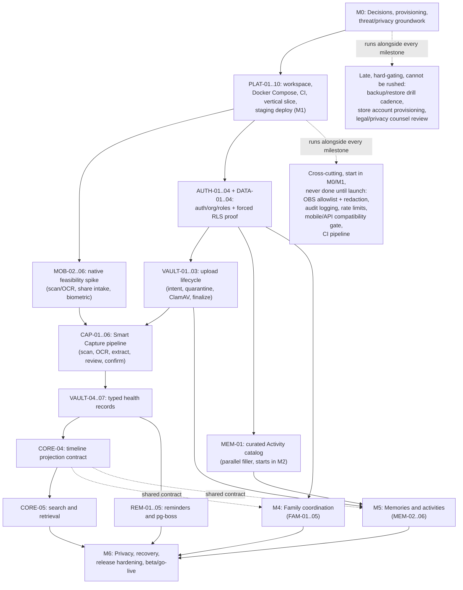

# LittleArc MVP Implementation Roadmap

> **For agentic workers:** REQUIRED SUB-SKILL: Use `superpowers:writing-plans` to turn each work package into a task-level plan, then use `superpowers:subagent-driven-development` or `superpowers:executing-plans` to implement it. Track execution with checkbox syntax.

**Goal:** Sequence, staff, and verify the full approved LittleArc MVP (all six product modules on iOS and Android) from the current greenfield repository to a launched, privacy- and security-gated production release, without re-deriving product or architecture decisions already approved.
**Architecture:** Mobile-only React Native + Expo (Expo Router, local builds, no EAS Build/Submit/Update) talking to a modular Fastify + tRPC API backed by PostgreSQL (Drizzle ORM, forced Row Level Security, pg-boss background jobs) and Cloudflare R2 object storage, with better-auth for identity/organization/roles, a provider-neutral AI extraction layer for Smart Capture, and Railway as the hosting platform. See `docs/core/architecture.md` for the authoritative design.
**Tech Stack:** TypeScript everywhere; pnpm workspace + Turborepo + Biome; Expo SDK (latest stable, pinned at bootstrap) with the mandatory React Native New Architecture; Fastify 5+, tRPC 11+, Zod; better-auth + `@better-auth/expo` + `@better-auth/drizzle-adapter`; PostgreSQL + Drizzle; pg-boss; MinIO (local) / Cloudflare R2 (production); Mailpit (local) / Resend (production); Vercel AI SDK 7; PostHog Cloud EU; Sentry; Fastlane + Xcode/Gradle for local signing and release.

---

## 0. How to Use This Roadmap

This document sequences **work**, not code. It does not restate the product plan (`docs/core/plan.md`) or the architecture (`docs/core/architecture.md`) — it assumes both are read and approved, and it defers to them on any question of *what* to build or *how* the system is designed. This roadmap answers *in what order*, *by whom*, *with what evidence of done*, and *at what estimated cost* the approved MVP gets built.

Every work package (WP) listed below is a planning unit, not an implementation plan. **Before writing code for any work package, the owning engineer or agent must first produce a bite-sized, test-driven implementation plan for that specific work package using `superpowers:writing-plans`, then execute it with `superpowers:subagent-driven-development` or `superpowers:executing-plans`.** No work package is "ready to code" until this sub-plan exists; this roadmap intentionally stops at the granularity of a milestone/work-package spine so that each package can be independently planned, reviewed, staffed, and tested.

**Live status.** The current done / in-progress / next state of every work package is tracked in `docs/core/implementation-status.md`. That file is the single source of truth for progress; update it whenever a work package starts, completes, blocks, or is deferred.

---

## 1. Document Purpose, Authoritative Inputs, and Scope Boundaries

**Purpose.** Give a technical lead everything needed to: sequence engineering work across the full MVP, split the roadmap into follow-on task-level implementation plans, assign owners across workstreams, track progress with checkboxes, and verify milestone exits with objective evidence — from a repository that today contains only approved documentation.

**Authoritative inputs (in priority order):**
1. `docs/core/plan.md` — approved LittleArc product plan (364 lines). Defines the six MVP modules, success criteria, scope boundaries, and monetization posture. This roadmap does not change product scope.
2. `docs/core/architecture.md` — approved LittleArc mobile architecture and tech stack (1474 lines, last reviewed 2026-07-13). Defines every technical decision, data model, security control, and the baseline implementation sequence (§23–§25). This roadmap operationalizes that sequence; it does not replace it.
3. Research artifacts (`research_implementation_roadmap/`): product/architecture implementation analysis, mobile/native delivery verification, backend/platform verification, and Context7 version-sensitive documentation checks — all consulted in full and cited throughout, particularly in §14 (version-sensitive constraints) and §21 (sources).

**Scope boundaries — this roadmap explicitly does NOT:**
- Add active billing/paywall implementation. `PAYWALL_ENABLED` stays `false` throughout every milestone in this roadmap; only a minimal dormant per-household entitlement/plan schema stub is scheduled (see Decision Register DEC-01).
- Add real-time sync, general offline writes, client-side end-to-end file encryption, a web app, home-screen widgets, WhatsApp/SMS reminders, government (ABHA/U-WIN/DigiLocker) integrations, or any other Phase 1.5+/Phase 2+/Phase 3+/Phase 4 item listed in plan.md §13 or architecture.md §26.
- Modify `docs/core/plan.md` or `docs/core/architecture.md`. Where research surfaced an implementation-level refinement (e.g., pg-boss `singleton` queue policies, R2 `ChecksumAlgorithm` at presign), this roadmap schedules it as a work package inside the existing architecture rather than proposing an architectural change, because no research finding contradicted the approved architecture.
- Contain implementation code. Every deliverable below is a planning unit; code lives in follow-on TDD implementation plans.

**Roadmap format conventions:**
- Work packages use stable IDs of the form `<WORKSTREAM>-<NN>` (e.g., `AUTH-03`, `VAULT-05`). IDs are unique across the whole roadmap and are referenced by the traceability matrix (§11), decision register (§15), and risk register (§17).
- "File/directory surface" columns name the exact repository paths a work package will create or modify, per the repository map in §6. Because the repository is greenfield, no line numbers are cited for files that do not yet exist.
- Effort ranges are engineering-weeks (see §4 for the estimate model) and are explicitly planning ranges, not commitments.


---

## 2. Current Baseline and Planning Assumptions

**Baseline as of this roadmap's authoring:**
- The repository (`/Users/nishanth/zealer/projects/litlearc`) contains only `docs/core/plan.md` and `docs/core/architecture.md`. There is no `package.json`, no workspace manifest, no CI configuration, no source code, and no infrastructure-as-code.
- No vendor accounts (Apple Developer, Google Play Console, Railway, Cloudflare R2, Resend, PostHog, Sentry, AI provider) are confirmed provisioned. This roadmap treats provisioning as in-scope, first-milestone work (§8, M0), not an implicit prerequisite assumed to already exist.
- No decision has yet been recorded on the items architecture.md left open by design (§10.2 Google OAuth flow choice, §12.5 vision-fallback provider) or the items research identified as unaddressed gaps (dormant Plus schema shape, pg-boss schema migration ownership, R2 checksum support, data-residency owner). These are formalized in the Decision Register (§15).

**Planning assumptions this roadmap makes explicit:**
1. The exact Expo SDK version is **not** pinned by this roadmap. Research confirmed Expo SDK 57 (React Native 0.86) as latest stable at research time, with the New Architecture mandatory since SDK 55 — but architecture.md itself requires re-verifying "the latest stable Expo SDK at bootstrap." This roadmap requires the M2 native-feasibility work package to re-check the current latest stable SDK before pinning, and requires re-verification at each subsequent milestone boundary if more than 60 days elapse (see §14).
2. A cross-functional team exists or will be staffed before M0 exits (see §4); this roadmap does not plan around a single-person team, though the lean 2-engineer model is provided as a floor case.
3. Vendor/legal lead times (Apple/Google enrollment, AI provider DPA, India DPDP counsel review) are external and do not compress with additional engineering headcount; they are modeled as calendar-time additions independent of the engineering-week estimates (§4, §16).
4. Local development requires macOS with current Xcode, Android Studio, Docker Desktop, and Ruby/Bundler/Fastlane per architecture.md §19.1 — this roadmap assumes every mobile-capable engineer has this environment before M1 exits.
5. All environment variables, secrets, and provider credentials are managed outside version control from the first commit (architecture.md §6); no work package in this roadmap stores a secret in the repository.

---

## 3. Delivery Principles

1. **Vertical slices over horizontal layers.** Every milestone must produce a demonstrably working, end-to-end slice of the product on both platforms — not just a completed layer (e.g., "the API is done" is not an exit gate; "the vaccine-card journey works end-to-end on both platforms" is).
2. **Test-driven, bite-sized implementation plans.** Every work package below is deliberately scoped to be small enough for one `superpowers:writing-plans` cycle. No engineer or agent starts coding a work package without first producing its task-level TDD plan; no work package is marked done without its own passing tests.
3. **Privacy and security gates block milestone exit, not just launch.** Tenant isolation (forced RLS + server authorization), AI review-before-persist, and telemetry allowlisting are enforced starting in M2/M3, not deferred to the final milestone (§13).
4. **Small, reviewable commits.** Work packages are further decomposed into commit-sized steps inside their TDD implementation plans; no work package should require a single, unreviewable, multi-thousand-line commit.
5. **Additive mobile/API compatibility from the first shipped build.** Once any build reaches TestFlight/Play internal testing, all subsequent API changes follow the additive contract discipline in architecture.md §9 (add fields/procedures, never rename/remove for at least 90 days, `/mobile-config` build gating). This discipline starts at M3, the first milestone where an installable build exists.
6. **Evidence before milestone exit.** No milestone is declared complete on the basis of a status update alone; every milestone in §8 lists the exact evidence artifact required (a CI run, a recorded test matrix, a signed-off checklist, a timed drill log).
7. **No hidden production data in non-production environments.** Local and staging environments use only synthetic or explicitly consented fixture data (architecture.md §6, §19.3); no work package in this roadmap creates a path for real child data to reach a non-production environment.
8. **YAGNI and scope protection.** Any request to add a Phase 1.5+/Phase 2+ feature, active billing, or a non-approved architectural change is declined at the roadmap level and redirected to a future roadmap revision (§20).

---

## 4. Team, Capacity, and Estimate Model

**Estimate model.** All effort figures are **engineering-weeks**: one engineer, one focused week (~30–32 productive hours after standing meetings, code review, and context switching are accounted for). Ranges reflect genuine uncertainty in a greenfield build and are **planning ranges, not commitments** — they are inputs to sequencing and staffing decisions, not delivery contracts. Ranges exclude external, non-compressible lead times (store review, legal/DPA review, backup-restore drill cadence), which are modeled separately in §16 as calendar-time additions regardless of staffing level.

**Two staffing models:**

| Model | Composition | Notes |
|---|---|---|
| **Lean (2 engineers)** | 1× full-stack engineer, mobile-leaning (Expo Router, native module integration, Swift/Kotlin as needed) + 1× full-stack engineer, backend-leaning (Fastify/tRPC/Drizzle/pg-boss). Both share QA, security-test authorship, and release engineering duties. | Floor case. Parallel workstreams (e.g., Family Coordination and Memory/Activities in M4/M5) cannot run concurrently with this staffing — they serialize, lengthening elapsed time disproportionately to engineering-week totals. |
| **Recommended (4 engineers, cross-functional)** | 2× mobile/React Native engineers (one with native module/Swift/Kotlin depth), 1× backend/platform engineer (Fastify/tRPC/Drizzle/pg-boss/Railway), 1× full-stack engineer with QA/security test authorship as a primary responsibility. Plus fractional support: ~0.5 FTE product/design, contracted legal/privacy counsel (not FTE, engaged per §16). | Enables the parallel tracks called out in §9 (Family Coordination and Memory/Activities work concurrently with the Wedge's tail end; store/legal/AI-vendor provisioning runs alongside engineering from M0). |

**Total engineering-week ranges by milestone, by staffing model** (see §8 for full per-milestone breakdown). **The Lean and Recommended totals are not the same pool of work divided across a different headcount** — each staffing model has its own eng-week total because §8's per-milestone effort notes model real serialization, context-switching, and handoff/rework overhead that the 2-engineer model incurs and the 4-engineer model largely avoids (e.g., M2's native spikes and auth/RLS work compete for the same two people in Lean but proceed on separate engineers concurrently in Recommended; M3's native+backend+review-UI work serializes further in Lean). Eng-weeks are therefore not a staffing-independent quantity that simply gets divided by headcount:

| Milestone | Lean eng-weeks (2 engineers) | Recommended eng-weeks (4 engineers) |
|---|---|---|
| M0 — Kickoff, decisions, provisioning, threat/privacy groundwork | 4–5 | 3–4 |
| M1 — Workspace/platform bootstrap and one-call vertical slice | 5–6 | 4–5 |
| M2 — Native feasibility + auth/org/RLS foundation | 15–18 | 12–17 |
| M3 — Wedge | 30–36 | 24–32 |
| M4 — Family coordination | 8–10 | 7–10 |
| M5 — Memories and activities | 9–11 | 8–11 |
| M6 — Privacy/recovery/operations/release hardening and beta/go-live | 13–15 | 11–15 |
| **Total** | **84–101 eng-weeks** | **69–94 eng-weeks** |

**Indicative elapsed-time ranges (planning ranges, not commitments):**

| Staffing model | Elapsed calendar time | Rationale |
|---|---|---|
| Lean (2 engineers) | **45–57 weeks (≈10.5–13 months)** | 84–101 eng-weeks ÷ 2 engineers (≈42–51 weeks), with limited parallelization (M4/M5 largely serialize after M3), plus 3–6 weeks of external, non-compressible lead-time buffer (§16) that mostly adds to the schedule serially under this staffing model, since the same two engineers also carry release/legal coordination alongside their engineering load. |
| Recommended (4 engineers, cross-functional) | **19–27 weeks (≈4.5–6.5 months)** | 69–94 eng-weeks spread across 4 engineers with real parallelization: `FAM-02`–`FAM-05`, `MEM-02`–`MEM-06`, and the curated Activity catalog (`MEM-01`) groundwork start while M3's native-blocked work is still in flight (§9); store/legal/AI-vendor provisioning (M0) overlaps engineering rather than following it, which largely absorbs the external lead-time buffer into the overlapped schedule instead of adding it on top. This range remains defensible only because of that explicit parallelization and overlap, not because the underlying eng-week total is smaller in some staffing-independent sense. |

Both ranges assume no more than one major scope change and no more than one native-feasibility surprise requiring architecture-compatible rework (a spike failure that requires redesigning within the approved architecture, not a new architecture). A second such surprise should trigger an explicit re-estimate, not silent schedule slip.


---

## 5. Workstreams and Ownership Guidance

Fourteen workstreams span the roadmap. Each work package below belongs to exactly one workstream (its ID prefix). A single engineer may own multiple workstreams in the lean model; in the recommended model, ownership should follow the "typical owner" column.

| ID prefix | Workstream | Typical owner (recommended model) | Active milestones |
|---|---|---|---|
| `PLAT` | Platform/tooling (workspace, CI, Docker Compose, shared packages) | Backend/platform engineer | M0–M6 (continuous) |
| `MOB` | Mobile shell/native (Expo Router shell, native modules, prebuild, signing) | Mobile engineers | M1–M6 |
| `AUTH` | Identity/authorization (better-auth, organizations, roles, invitations) | Backend/platform engineer | M2, M4 |
| `DATA` | Data/RLS (Drizzle schema, migrations, tenant isolation, pg-boss schema) | Backend/platform engineer | M2, M3 |
| `VAULT` | Vault/storage (uploads, quarantine, documents, health records) | Backend engineer + 1 mobile engineer | M3 |
| `CAP` | Smart Capture/AI (native scan/OCR, extraction service, review UI, fixtures) | 1 mobile engineer (native) + backend engineer (extraction service) | M2 (spike), M3 |
| `CORE` | Timeline/search/profile/emergency | Mobile engineer + backend engineer (shared timeline contract) | M2 (contract), M3 |
| `REM` | Reminders/notifications (pg-boss jobs, push, email backup) | Backend/platform engineer | M3 |
| `FAM` | Family coordination (dashboard, invites, roles, tasks/handovers) | Full-stack/QA engineer + 1 mobile engineer | M4 |
| `MEM` | Memories/activities (capsules, future unlock, curated catalog, optional AI) | Full-stack/QA engineer + 1 mobile engineer | M2 (catalog content, parallel), M5 |
| `PRIV` | Privacy/export/deletion | Backend/platform engineer | M6 |
| `OBS` | Observability/operations (telemetry allowlist, error redaction, backups, dashboards) | Backend/platform engineer, started in M0 | M0, M1, M2, M3, M6 (continuous thereafter) |
| `REL` | Release/store/legal (Apple/Google accounts, signing, Fastlane, legal review) | Backend/platform engineer + contracted legal counsel | M0–M6 (continuous) |
| `QA` | QA/security/accessibility/performance (adversarial tests, Maestro, accessibility, perf) | Full-stack/QA engineer, supported by all engineers per-feature | M2–M6 (continuous) |

**Ownership rule:** every work package must have exactly one named accountable owner at kickoff, even under the lean model where one person may own several workstreams. Shared workstreams (e.g., the timeline-projection contract used by every product module) must have a single owning engineer who reviews all other workstreams' use of the shared contract, to avoid the divergent-implementation risk flagged in research (see `findings_product_architecture.md` §9, "Sequencing hazards").

---

## 6. Initial Repository and File Map

This is the exact initial tree to create, following architecture.md §5. No file below currently exists; no line numbers are claimed for any of them. Each path's responsibility is stated so a technical lead can assign work packages directly against it.

```text
.
├── package.json                     # Root workspace manifest; scripts: lint, typecheck, test, build, db:migrate, db:seed, dev
├── pnpm-workspace.yaml               # Declares apps/* and packages/* as workspace members
├── turbo.json                        # Turborepo pipeline: build/lint/typecheck/test task graph and caching
├── .node-version                     # Pins current Node LTS (minimum 22.12, per pg-boss/tooling requirements)
├── biome.json                        # Root Biome configuration extended by packages/config
├── docker-compose.yml                # postgres, minio, mailpit, clamav local services
├── railway.toml                       # Railway deployment config: build/start commands (`start:all`), pre-deploy step (Drizzle migrations from M1's `PLAT-10`, pg-boss migrations added by M2's `DATA-05`)
├── Gemfile                           # Pinned Fastlane via Bundler; Gemfile.lock committed
├── .github/workflows/ci.yml          # CI pipeline: install, lint, typecheck, unit, integration, migration-from-zero, dependency/secret scan, prod container build
├── apps/
│   ├── mobile/
│   │   ├── app.config.ts             # Expo app config: bundle IDs, deep-link scheme, plugins, environment-specific values
│   │   ├── app/                      # Expo Router routes
│   │   │   ├── (auth)/sign-in.tsx, sign-up.tsx, verify-email.tsx, accept-invite.tsx
│   │   │   ├── onboarding/child.tsx
│   │   │   ├── (tabs)/today/, timeline/, vault/, activities/, family/
│   │   │   ├── capture/scan.tsx, extract.tsx, review.tsx, save.tsx
│   │   │   ├── emergency.tsx         # Reachable in two taps; must not depend on a network request
│   │   │   └── settings/
│   │   ├── src/
│   │   │   ├── features/             # profile, vault, timeline, memory, activities, family — feature-scoped UI + hooks
│   │   │   ├── components/           # Shared presentational components
│   │   │   ├── lib/                  # auth client, tRPC client, analytics, error reporting wrappers
│   │   │   ├── offline/               # EmergencySnapshotStore (encrypted MMKV) implementation
│   │   │   └── native/                # Typed interfaces for local native modules (DocumentCapture, ShareIntake)
│   │   ├── modules/
│   │   │   ├── document-capture/      # Local Expo Module: iOS VisionKit/Vision, Android ML Kit wrappers
│   │   │   └── share-intake/          # Local config plugin + native target: iOS Share Extension/App Group, Android share intents
│   │   └── fastlane/                  # Kept outside generated ios/android folders so `expo prebuild --clean` cannot delete it
│   └── api/
│       ├── Dockerfile
│       └── src/
│           ├── server.ts              # Fastify HTTP entrypoint (`start:api`)
│           ├── worker.ts              # pg-boss worker entrypoint (`start:worker`)
│           ├── all.ts                 # Combined API+worker entrypoint for low-scale single-service mode (`start:all`)
│           ├── routers/                # tRPC routers by product module: profile, timeline, vault, memories, activities, family, reminders, exports, account
│           ├── auth/                   # better-auth server config, organization plugin, static access-control roles, organizationHooks
│           ├── services/               # storage (R2 adapter), notifications (Expo Push), email (Resend), AI (Vercel AI SDK adapter), exports
│           ├── jobs/                    # pg-boss job handlers: reminders, push receipts, upload cleanup, thumbnailing, export creation, physical deletion
│           └── plugins/                 # Fastify plugins: request ID/logging, security headers, centralized rate-limit policy framework, tRPC context, mobile-config, health routes
├── packages/
│   ├── contracts/                    # Shared Zod schemas, enums, mobile-safe DTOs, Smart Capture extraction schemas per category
│   ├── db/                            # Drizzle schema, migrations, RLS policies, tenant-transaction wrapper, repositories
│   ├── api-types/                    # Type-only AppRouter export; no server runtime code is ever imported by the mobile app
│   ├── observability/                # PostHog event allowlist, Sentry redaction config, structured-logging redaction rules
│   └── config/                       # Shared tsconfig and Biome configuration consumed by every app/package
├── tooling/
│   ├── docker/                        # MinIO bucket bootstrap, ClamAV definitions update, Mailpit configuration
│   └── scripts/                       # backup.sh (independent encrypted pg_dump), restore-drill.sh, release checks, fixture/seed generators
```

The mobile app imports the tRPC router as a **type-only** dependency from `packages/api-types`; server implementations and secrets must never enter the Metro dependency graph (architecture.md §5).


---

## 7. Milestone Spine

Seven milestones (M0–M6) implement the full MVP, preserving architecture.md §23's five-phase spine while making sequencing, ownership, and evidence explicit, and pulling forward the items research flagged as under-scheduled (store/legal/AI-vendor provisioning, the curated Activity catalog, and the first backup/restore drill).

| # | Milestone | Primary architecture reference | Lean eng-weeks | Recommended eng-weeks |
|---|---|---|---|---|
| M0 | Kickoff, decisions, provisioning, threat/privacy groundwork | §17.5, §20.2, §25 | 4–5 | 3–4 |
| M1 | Workspace/platform bootstrap and one-call vertical slice | §5, §8, §19, §21.5 | 5–6 | 4–5 |
| M2 | Native feasibility + auth/org/RLS foundation | §7.5–7.7, §10, §21.3, §23.1 | 15–18 | 12–17 |
| M3 | Wedge: profile/emergency/vault/upload/Smart Capture/health/timeline/search/reminders | §7.3–7.4, §11–15, §23.2 | 30–36 | 24–32 |
| M4 | Family coordination | §10.4–10.6, §23.3 | 8–10 | 7–10 |
| M5 | Memories and activities | §11.2, §16 (interplay), §23.4 | 9–11 | 8–11 |
| M6 | Privacy/recovery/operations/release hardening and beta/go-live | §16–20, §23.5, §24 | 13–15 | 11–15 |

These per-milestone figures are the same ones detailed in §8 and totaled by staffing model in §4; the two columns are not the same pool of work divided differently — see §4 for why the Lean total is higher.

Milestones are numbered for reference, not strictly serial: M2's native-feasibility spike and M0's provisioning track run with intentional overlap (§9), and parts of M4/M5 begin before M3 fully exits under the recommended staffing model.

---

## 8. Milestone Detail

### M0 — Kickoff, Decisions, Provisioning, Threat/Privacy Groundwork

**Objective.** Resolve every planning-blocking decision, provision every vendor/store account with a multi-week lead time, and complete initial threat-modeling/privacy-impact groundwork — before any dependent feature work is allowed to proceed — so that M1–M6 never stall on an external dependency that could have started on day one. M0 and M1 intentionally overlap (§7, §9): M0's coordination-heavy tracks can run alongside early M1 tooling work; this objective is a gate on *feature* work that depends on a specific M0 decision or provisioned account, not a blanket ban on any code existing while M0 is still open.

**Prerequisite.** Approved `docs/core/plan.md` and `docs/core/architecture.md` (already satisfied).

**Parallel tracks.** All work packages in M0 are parallel to each other; none blocks another within this milestone.

| WP ID | Deliverable | Primary surface | Test/validation expectation |
|---|---|---|---|
| `REL-01` | Apple Developer Program enrollment; create production (`com.littlearc.app`) and staging (`com.littlearc.app.staging`) App IDs; enable Sign in with Apple and Push Notifications capabilities manually | External (Apple Developer portal); recorded in `docs/core/implementation-roadmap.md` decision log references only | Both App IDs visible in Apple Developer portal with capabilities enabled; screenshot/ID recorded as evidence |
| `REL-02` | Google Play Console account; production and staging app records; Firebase project created for FCM | External (Play Console, Firebase console) | Play Console app records exist; Firebase project ID recorded |
| `REL-03` | AI provider selection and DPA review (`DEC-05`): select a provider with acceptable no-training/no-retention API terms | External vendor contract; referenced from `packages/config` provider allowlist once M1 exists | Signed or counsel-approved DPA reference recorded; provider/model ID chosen for later server configuration |
| `REL-04` | Engage legal counsel for India DPDP and cross-border review; define review milestones aligned to M6 | External engagement letter | Counsel engagement confirmed with a defined review timeline reaching M6 |
| `REL-05` | Domain/DNS decisions: production apex (`littlearc.app`), staging domain, dedicated mobile-link domain (`links.littlearc.app`) | DNS registrar/provider | Domains registered; DNS delegated to the chosen provider |
| `OBS-01` | Threat-model workshop and initial privacy-impact assessment draft covering child-data classification (architecture.md §17.1) | Workshop notes referenced from `packages/observability` design notes once M1 exists | Workshop completed with a written threat model covering at minimum: tenant-isolation failure, AI data exfiltration, presigned-URL abuse, notification content leakage |
| `PLAT-00` | Tooling version snapshot: confirm current Node LTS, pnpm version, Fastify 5+/tRPC 11+ pairing, current stable Expo SDK (re-verify per §14, do not hard-pin in this roadmap) | Decision log entry, applied in `PLAT-01`/`PLAT-05` during M1 | Version snapshot dated and recorded; re-verification trigger documented for M2 bootstrap |
| `DEC-ALL` | Decision Register (§15) drafted and every `P0`-tagged decision resolved or explicitly scheduled with a decision-by milestone | This document, §15 | Decision register has zero unresolved `P0` items before M0 exits |

**Exit gate.** Decision register (§15) has no unresolved P0 item; Apple and Google developer accounts are active with the correct App IDs/capabilities; an AI vendor is selected with an approved or in-review DPA; legal engagement has started with a defined review timeline; the initial threat model is written.

**Evidence artifacts.** Decision register export with zero open P0 rows; Apple Developer portal and Play Console screenshots/IDs; DPA reference document; legal engagement letter reference; threat-model workshop notes.

**Effort.** Lean: 4–5 eng-weeks (mostly coordination, not full-time engineering — can run alongside early M1 tooling work). Recommended: 3–4 eng-weeks distributed across the team plus fractional legal/product time.

**Non-goals.** No code, no infrastructure provisioning beyond account creation, no user-facing feature, no committed dependency versions beyond the version snapshot.


### M1 — Workspace/Platform Bootstrap and One-Call Vertical Slice

**Objective.** Stand up the exact repository/file map from §6, a fully working local Docker Compose stack, a CI baseline, and one demonstrable vertical slice — an Expo Router screen calling a real tRPC procedure through Fastify to PostgreSQL and back — proving the whole toolchain works before any product feature or native module is attempted.

**Prerequisite.** M0's tooling version snapshot (`PLAT-00`).

**Parallel tracks.** `PLAT-*` and `MOB-01` can proceed in parallel once the workspace root exists; `OBS-02` (allowlist/redaction skeletons) is a low-risk parallel filler. `PLAT-10` (staging provisioning/deploy) depends on `PLAT-05`/`PLAT-08` (the API skeleton and local vertical slice) existing first, so it runs toward the end of M1 once there is something deployable, not from day one.

| WP ID | Deliverable | Primary surface | Test/validation expectation |
|---|---|---|---|
| `PLAT-01` | pnpm workspace + Turborepo + Biome scaffold | `package.json`, `pnpm-workspace.yaml`, `turbo.json`, `.node-version`, `biome.json` | `pnpm install` succeeds; `pnpm lint` runs Biome across an empty workspace with zero errors |
| `PLAT-02` | Shared TypeScript/Biome configuration package | `packages/config/` | Every workspace package extends `packages/config` tsconfig without duplicated compiler options |
| `PLAT-03` | Docker Compose local stack | `docker-compose.yml`, `tooling/docker/` | `docker compose up -d` brings up postgres, minio, mailpit, clamav; each service passes its own health check |
| `PLAT-04` | CI pipeline baseline | `.github/workflows/ci.yml` | GitHub Actions run is green on: install (frozen lockfile), Biome check, TypeScript typecheck, empty-package build |
| `PLAT-05` | `apps/api` skeleton: Fastify composition (request ID/logging, security headers, a centralized per-route/per-operation rate-limit policy framework — not a stub), tRPC adapter, health routes | `apps/api/src/server.ts`, `worker.ts`, `all.ts`, `plugins/` | `/health/live` and `/health/ready` return 200 locally; `/health/ready` fails closed if PostgreSQL is unreachable; the rate-limit framework rejects a request exceeding a configured limit with 429 on at least one representative route in this milestone; per-operation limits for auth, invitations, AI extraction, uploads, exports, and deletion are added by their owning work packages (`AUTH-01`/`AUTH-05`, `CAP-02`, `VAULT-01`, `PRIV-01`/`PRIV-02`) before their milestone exits, with `QA-02` as final cross-cutting regression evidence |
| `PLAT-06` | `packages/contracts` skeleton: shared Zod schema conventions, base enums | `packages/contracts/` | A sample schema round-trips through both API and a Vitest unit test |
| `PLAT-07` | `packages/api-types` type-only AppRouter export | `packages/api-types/` | Mobile app can import `AppRouter` as a type without pulling any server runtime code into the Metro bundle (verified by a bundle-analysis check) |
| `PLAT-08` | One-call vertical slice: a "ping" tRPC procedure exercised from an Expo Router screen, round-tripping through Fastify to PostgreSQL | `apps/mobile/app/`, `apps/api/src/routers/` | Manual/E2E check: screen displays a value sourced from PostgreSQL via tRPC on both iOS simulator and Android emulator; CI includes an automated smoke test hitting the real tRPC procedure end-to-end (not just a type-check) to catch a Fastify/tRPC version mismatch, per research finding on silent Fastify v4/tRPC v11 incompatibility |
| `MOB-01` | Expo Router app skeleton bootstrap, pinned to the current latest stable Expo SDK (re-verified per `PLAT-00`), New Architecture confirmed on by default | `apps/mobile/app.config.ts`, `apps/mobile/app/` | `npx expo-doctor` (or equivalent dependency audit) passes; app boots on iOS simulator and Android emulator with no New Architecture warnings |
| `OBS-02` | `packages/observability` skeleton: allowlist schema shape and redaction utility stubs (no product events yet) | `packages/observability/` | Unit test asserts an event outside the (currently empty) allowlist is rejected at compile/lint time |
| `PLAT-09` | `tooling/scripts` skeleton: `backup.sh` (encrypted `pg_dump` wrapper), `restore-drill.sh`, seed/fixture generator entrypoints | `tooling/scripts/` | `backup.sh` produces a valid encrypted dump against the local Docker Postgres; `restore-drill.sh` restores it into a scratch database and the row counts match |
| `PLAT-10` | Staging deployment ownership: provision the Railway staging project (Singapore region), a staging PostgreSQL database, and a separate R2 staging bucket/token (distinct from any future production credentials); deploy the combined `start:all` image (the `PLAT-08` one-call vertical slice) to that staging project; verify the public staging `/health/ready` endpoint and a real mobile-app call against staging | `railway.toml` (or dashboard-recorded equivalent, referenced from this roadmap), `apps/api/Dockerfile`, `apps/api/src/all.ts` | Staging `/health/ready` returns 200 over the public internet with PostgreSQL reachable; the mobile app, pointed at the staging API URL, completes the same vertical-slice call that passes locally in `PLAT-08`; recorded screen capture of both checks. `DATA-05` (M2) later upgrades this same pre-deploy step to also run pg-boss's schema migrations alongside Drizzle's |

**Exit gate.** `pnpm install`, `pnpm lint`, `pnpm typecheck`, and a build task pass in CI; `docker compose up -d` brings up a fully healthy local stack; the one-call vertical slice returns real PostgreSQL data through tRPC on both iOS and Android; the Fastify/tRPC version-compatibility smoke test passes in CI; the combined `start:all` image is deployed to Railway staging (Singapore) with its own staging PostgreSQL database and a separate R2 staging bucket/token, and the public staging `/health/ready` endpoint and a mobile call against staging both succeed (`PLAT-10`).

**Evidence artifacts.** Green CI run link; `docker compose ps` health output; a recorded run (log or screen capture) of the vertical slice on both platforms; CI log showing the tRPC smoke test step; a recorded staging `/health/ready` response and a mobile-app screen capture calling the deployed staging vertical slice successfully (`PLAT-10`).

**Effort.** Lean: 5–6 eng-weeks. Recommended: 4–5 eng-weeks (parallel `PLAT-*` and `MOB-01` ownership).

**Non-goals.** No native modules, no authentication, no product UI beyond the single vertical-slice screen, no real product schema.

### M2 — Native Feasibility + Auth/Org/RLS Foundation

**Objective.** Prove, on physical devices, that document scan/OCR, share-sheet intake, and biometric lock all work on the pinned Expo SDK/New Architecture; stand up better-auth (email/Google/Apple) with organizations and static roles; and prove PostgreSQL forced RLS fails closed under an automated cross-tenant test matrix. This is the architecture's own highest-risk, must-pass-before-feature-work gate (architecture.md §7.5, §23.1, §25).

**Prerequisite.** M1 exit (working toolchain, vertical slice, CI baseline).

**Parallel tracks.** Native spikes (`MOB-02`–`MOB-06`) and backend auth/data work (`AUTH-*`, `DATA-*`) proceed in parallel on different engineers. `MOB-07` (shared OS-permission rationale flow) should land alongside the native spikes since every one of them (camera scan, share intake, push registration) needs it. `MEM-01` (curated Activity catalog content and CRUD) has no dependency on native spikes or Smart Capture, but its authenticated end-to-end staging flow requires the M2 auth/org/RLS baseline (`AUTH-04`), so it should start here as a parallel, low-risk filler track for any engineer not blocked on native work once that baseline exists, per research recommendation (`findings_product_architecture.md` §3, §10). `REL-06` (store/legal provisioning continuation) and `OBS-01` (threat-model refinement) continue in parallel from M0. `OBS-07` (first backup/restore drill) runs at the tail end of M2, once the `PLAT-10` staging database exists, and is not blocked on the native/auth work.

| WP ID | Deliverable | Primary surface | Test/validation expectation |
|---|---|---|---|
| `MOB-02` | Native feasibility spike: document-capture module — iOS VisionKit document camera + Apple Vision text recognition; Android ML Kit Document Scanner + Text Recognition v2; Android fallback (`expo-camera` + manual crop) for devices without compatible Play services | `apps/mobile/modules/document-capture/` | Passes on a recorded physical-device matrix (≥1 iOS device, ≥2 Android devices including one without current Play services) for English and Hindi/Devanagari samples; built directly inside the target module structure, not disposable prototype code |
| `MOB-03` | Native feasibility spike: share-intake module — iOS Share Extension + App Group (config-plugin-generated Xcode target, manually signed since no EAS Build), Android share intent filters + native handoff | `apps/mobile/modules/share-intake/` | Passes on physical devices for images and PDFs shared from WhatsApp, Photos/Gallery, Files, and email; Share Extension signing verified compatible with Xcode automatic signing (§20.3) |
| `MOB-04` | Biometric lock spike: `expo-local-authentication` + encrypted MMKV keyed via SecureStore; device-credential fallback; enrollment-change invalidation behavior | `apps/mobile/src/offline/`, `apps/mobile/src/lib/` | Passes on physical devices for Face ID, fingerprint, and device-credential fallback; enrollment-change test clears the snapshot and forces re-authentication |
| `MOB-05` | Android 16 KB native-library page-size alignment check integrated into the spike and into CI (APK Analyzer or `check_elf_alignment.sh`, plus a 16 KB Android Emulator smoke pass) | `.github/workflows/ci.yml`, spike documentation | CI or spike log shows every native dependency (ML Kit wrapper, capture module, share module) passes alignment check; this check re-runs at every subsequent milestone that adds a native dependency, not only once |
| `MOB-06` | `expo prebuild --clean` reproducibility lane for both platforms | `apps/mobile/`, CI script | Running `expo prebuild --clean` twice in a row produces byte-identical (or behaviorally identical, documented) native project output; committed as a repeatable CI/local check |
| `MOB-07` | Shared OS-permission rationale flow for camera, photos, and notifications: an in-app rationale screen/sheet shown before the native permission prompt is ever triggered, reused by every requesting feature (`MOB-02`/`CAP-01` camera, `MOB-03` photos/share, `REM-03` notifications); manual-entry/in-app/email degraded paths remain fully usable when a permission is denied or later revoked | `apps/mobile/src/lib/`, `apps/mobile/src/components/` | Automated test confirms no native permission prompt fires without the in-app rationale step first; a manual test confirms scan, share-intake, and reminder features degrade to their manual/in-app/email path (not a dead end) when the corresponding permission is denied |
| `AUTH-01` | better-auth server integration: `@better-auth/expo`, `@better-auth/drizzle-adapter`, email/password with verification, per-operation rate-limit policy (via the `PLAT-05` framework) on sign-in/sign-up/verification attempts | `apps/api/src/auth/` | Email sign-up → verification email (Mailpit locally) → sign-in round-trips in an integration test; a test confirms sign-in attempts are rate-limited past a configured threshold |
| `AUTH-02` | Google sign-in via better-auth browser OAuth (per `DEC-02` default) | `apps/api/src/auth/`, `apps/mobile/src/lib/` | Staging OAuth sign-in succeeds end-to-end, recorded |
| `AUTH-03` | Apple native Sign-In: `expo-apple-authentication` + better-auth ID-token verification, including explicit JWKS/`aud`/`iss`/expiry validation spike (per `DEC-03`) | `apps/api/src/auth/`, `apps/mobile/src/native/` | Physical-device test: Apple Sign-In produces a valid session; a tampered/expired token is rejected in an integration test |
| `AUTH-04` | Organization plugin + static custom access-control roles (owner/parent/grandparent/guardian) using `organizationHooks` (not the deprecated `organizationCreation` API) | `apps/api/src/auth/` | Unit/integration tests cover organization creation, membership, and each static role's declared permission set |
| `AUTH-05` | Invitation flow + HTTPS mobile-link gateway (`/links/*`), staging `apple-app-site-association` and `assetlinks.json`, per-operation rate-limit policy (via `PLAT-05`) on invitation creation/acceptance | `apps/api/src/plugins/`, DNS/hosting config | Staging invitation link opens the correct authenticated app route on both platforms when installed, and a store fallback page when not installed; a test confirms invitation creation/acceptance is rate-limited past a configured threshold |
| `DATA-01` | Drizzle schema baseline: better-auth tables plus `children`, `child_access`, `consents` skeleton, initial migrations, and the minimal dormant `household_plans` table per `DEC-01` (`organization_id`, plan-status enum defaulting to `free`, `effective_at`; no billing logic or provider dependency) | `packages/db/` | CI migration-from-zero job applies all migrations against an empty database with zero errors; a schema test confirms `household_plans` exists with the correct columns/enum default and that no billing/provider code path references it |
| `DATA-02` | Forced RLS policy set on every tenant table plus the parameter-safe tenant-transaction wrapper (`SET LOCAL app.organization_id`/`app.user_id` set from verified, non-interpolated values) | `packages/db/` | Every tenant table has `ENABLE ROW LEVEL SECURITY` and `FORCE ROW LEVEL SECURITY`; wrapper unit-tested against injection-style input to confirm no raw string interpolation path exists |
| `DATA-03` | Automated tenant-isolation fail-closed test suite (cross-household matrix; a request with no context returns zero rows) | `packages/db/`, `apps/api` integration tests | CI-run matrix passes: household A cannot read/write household B's rows under any role; missing context returns zero rows, not an error leaking existence |
| `DATA-04` | Runtime database role least-privilege verification: confirm the application role lacks `BYPASSRLS`, confirm whether it is the table owner (which determines whether FORCE RLS is load-bearing), and that a separate migration/admin role exists | `packages/db/`, deployment scripts | A recorded check (SQL query + documented result) confirms role configuration before any tenant data workstream (M3) begins |
| `DATA-05` | pg-boss internal schema migration sequencing decision executed (per `DEC-06`): pg-boss's own schema bootstrap integrated into the same Railway pre-deploy step as Drizzle migrations, guarded by the same advisory lock — upgrades the `PLAT-10` staging pre-deploy step (M1) to also run pg-boss migrations, not a new deployment path | `apps/api/`, `railway.toml`, deployment scripts | Local/staging pre-deploy run applies both Drizzle and pg-boss schema migrations in one guarded step with no persisted-filesystem dependency (Railway pre-deploy containers are ephemeral) |
| `MEM-01` | Curated Screen-Free Activity catalog: content schema, seed data, and CRUD/filter API+UI (age, setting, materials, skill goal) — parallel low-risk track, no dependency on native spikes or Smart Capture, but requires the M2 auth/org/RLS baseline (`AUTH-04`) for an authenticated end-to-end staging flow | `packages/contracts/`, `apps/api/src/routers/`, `apps/mobile/src/features/activities/` | A parent can browse and filter the curated catalog end-to-end in staging; no AI dependency exercised at this stage |
| `REL-06` | Store/legal provisioning continuation: App Store Connect TestFlight groups, Play internal testing track, APNs key + App Store Connect API key, Firebase `google-services.json` generation | External consoles + secure config generation | TestFlight group and Play internal track exist and are ready to receive a build once one exists (M3+) |
| `OBS-07` | First encrypted backup + restore drill: run `backup.sh` against the `PLAT-10` staging database and restore it into a disposable, isolated staging clone (never the live staging environment) at the M2/M3 boundary — proves the mechanism works before any real product data exists; distinct from `OBS-05` (M6), which automates and repeats this drill monthly | `tooling/scripts/backup.sh`, `restore-drill.sh` | A timed restore-drill log shows the encrypted backup restores successfully into the isolated staging clone with matching row counts |

**Exit gate.** Matches architecture.md §23.1 verbatim, made verifiable: all native dependencies work with the pinned Expo SDK/New Architecture on a recorded physical-device matrix; tenant isolation fails closed under the automated cross-tenant matrix in CI; local clean `expo prebuild --clean` is reproducible on both platforms; better-auth email/Google/Apple sign-in works end-to-end in staging; the shared OS-permission rationale flow (`MOB-07`) is in place ahead of every camera/photos/notification prompt; the first encrypted backup + restore drill (`OBS-07`) has succeeded against an isolated staging clone.

**Evidence artifacts.** Device test matrix (device model × OS version × capability × pass/fail); CI run showing the RLS cross-tenant matrix green; prebuild reproducibility log/checksum; staging OAuth sign-in recording for all three providers; Android 16 KB alignment check output; a recorded rationale-then-prompt sequence for camera/photos/notifications (`MOB-07`); the first timed restore-drill log (`OBS-07`).

**Effort.** Lean: 15–18 eng-weeks (native spikes and auth/RLS work serialize more without dedicated owners). Recommended: 12–17 eng-weeks (native spikes and auth/RLS proceed on separate engineers concurrently).

**Non-goals.** No vault/document persistence, no Smart Capture extraction service, no product feature UI beyond auth screens and the Activity catalog browse/filter screen, no reminders.


### M3 — Wedge: Profile/Emergency/Vault/Upload/Smart Capture/Health/Timeline/Search/Reminders

**Objective.** Deliver the architecture's "wedge" — the deepest, most differentiating MVP surface — as one demonstrable, end-to-end journey on both platforms: capture a document, extract and confirm health data, see it in the timeline, search for it, and receive a reminder derived from it, entirely offline-safe for the emergency card.

**Prerequisite.** M2 exit (native spikes passed, auth/org/RLS proven).

**Parallel tracks.** Within M3, `VAULT-*`/`CAP-*` (the Smart Capture pipeline) and `CORE-01`–`CORE-03` (profile/emergency/biometric enforcement) can proceed on different engineers once the upload lifecycle (`VAULT-01`/`VAULT-02`) lands, since the review-and-confirm flow depends on it. `REM-*` (reminders) is intentionally sequenced after the first real confirmed health record write path exists (`VAULT-05`), not built against synthetic stand-ins, per research finding on validating the true transactional-job-creation pattern.

| WP ID | Deliverable | Primary surface | Test/validation expectation |
|---|---|---|---|
| `CORE-01` | Child profile CRUD (create/edit; data model supports multiple children, MVP UI centers one active child) | `apps/mobile/app/onboarding/child.tsx`, `apps/api/src/routers/profile.ts`, `packages/db/` | A parent can create and edit a child profile end-to-end; multi-child data model verified with a second child in an integration test even though the UI surfaces one active child |
| `CORE-02` | Offline emergency snapshot: `EmergencySnapshotStore` backed by encrypted MMKV, refresh triggers (mutation, sign-in, child switch, online foreground), 30-day owner/parent retention and 7-day non-parent caregiver retention, `refreshedAt` display | `apps/mobile/src/offline/`, `apps/mobile/app/emergency.tsx` | Emergency screen opens with cached data after the device is placed in airplane mode; `refreshedAt` timestamp is visible and accurate; retention expiry enforced per role in a test |
| `CORE-03` | Biometric app-lock enforcement across the app shell: lock on cold start and after a 30-second background timeout, `FLAG_SECURE` on Android vault/document screens, iOS app-switcher content cover | `apps/mobile/app/_layout.tsx` (or equivalent root layout), `apps/mobile/src/lib/` | Automated/manual test confirms the app locks on cold start and after backgrounding; screenshot of the app switcher shows covered content, not live vault data |
| `VAULT-01` | Upload-intent lifecycle: quarantine bucket layout, exact-key/exact-`ContentType` presigned PUT, declared-byte quota reservation, per-operation rate-limit policy (via `PLAT-05`) on upload-intent creation, and (per `DEC-07`) an attempt to sign with `ChecksumAlgorithm`/`x-amz-checksum-sha256` if supported by the pinned R2 SDK version | `apps/api/src/services/storage.ts`, `apps/api/src/routers/vault/uploads.ts` | Integration test against real MinIO: intent creation reserves quota, presigned PUT succeeds, and an expired/abandoned intent releases its quota reservation; a test confirms upload-intent creation is rate-limited past a configured threshold |
| `VAULT-02` | Finalize worker: object HEAD/magic-byte/size/checksum verification, ClamAV scan, promotion from quarantine to final prefix | `apps/api/src/jobs/`, `apps/api/src/services/storage.ts` | Integration test: a valid file promotes to `ready`; a corrupted/oversized/malware-flagged file is rejected and never becomes downloadable |
| `VAULT-03` | Cleanup jobs (abandoned/rejected purge) plus R2 lifecycle rules defined as versioned, CI-applied configuration (Wrangler or S3 SDK `putBucketLifecycleConfiguration`), not manual dashboard configuration | `apps/api/src/jobs/`, `tooling/docker/` or IaC config file | Cleanup job purges an abandoned upload within the stated window in a test; lifecycle configuration is present in version control and applied via a scripted step |
| `VAULT-04` | Document CRUD (`documents`, `document_files`) and category taxonomy (identity, vaccinations, doctor visits, prescriptions, growth, insurance, emergency card, school health forms) | `packages/db/`, `apps/api/src/routers/vault/` | Category-scoped create/list/search integration tests pass for every category in plan.md §6.3 |
| `VAULT-05` | Vaccinations CRUD with due/given status (first real confirmed-record write path; unblocks `REM-*`) | `packages/db/`, `apps/api/src/routers/vault/vaccinations.ts` | A confirmed vaccination record with a due date exists in an integration test before any reminder work package begins |
| `VAULT-06` | Doctor visits and prescriptions CRUD (prescription extraction never generates dosage advice or modifies dosage) | `packages/db/`, `apps/api/src/routers/vault/visits.ts`, `prescriptions.ts` | Integration tests confirm prescription records store only parent-confirmed free-text medicine/frequency fields, never model-generated dosage recommendations |
| `VAULT-07` | Growth entries CRUD | `packages/db/`, `apps/api/src/routers/vault/growth.ts` | Integration test covers create/list with date-only (not timestamp) measurement dates |
| `CAP-01` | On-device scan/OCR product integration: `DocumentCapture.scan`/`recognizeText` wired into capture UI | `apps/mobile/app/capture/scan.tsx`, `apps/mobile/src/native/` | End-to-end manual test: physical-device scan produces cropped pages and OCR text for English and Hindi samples |
| `CAP-02` | Backend extraction service: Vercel AI SDK 7 `generateText` (non-streaming, so the full schema-validated output is available before any UI display) with `Output.object({ schema })`, provider/model selected by server configuration only; gated behind a feature-level AI text-extraction opt-in consent recorded at the household/account level (`packages/db/`, `apps/mobile/app/settings/`) — distinct from and prerequisite to `CAP-05`'s per-document vision-fallback consent; per-operation rate-limit policy (via `PLAT-05`) on extraction calls per household | `apps/api/src/services/ai.ts`, `packages/db/`, `apps/mobile/app/settings/` | Integration test with a mocked/sandboxed provider confirms schema validation runs on the complete response, never a partial stream; provider/model cannot be influenced by client input; a second integration test confirms the extraction service refuses to run for a household that has not granted the feature-level AI text-extraction consent, independent of any per-document vision-fallback consent state; a third test confirms extraction calls are rate-limited past a configured per-household threshold |
| `CAP-03` | Extraction schemas per category: vaccination, prescription, doctor visit, growth, identity/discharge, insurance | `packages/contracts/` | Each schema has bounded arrays/strings, explicit date parsing, and category-specific validation unit-tested against golden and adversarial fixtures |
| `CAP-04` | Review-and-confirm UI: candidate value, source evidence, validation warning, editable control; no persistence without explicit confirm | `apps/mobile/app/capture/review.tsx`, `save.tsx` | Automated test asserts there is no code path from extraction to database persistence that skips the confirm action |
| `CAP-05` | Vision-fallback consent flow: per-document explicit consent for the vision-fallback path specifically (layered on top of, and never a substitute for, `CAP-02`'s feature-level AI text-extraction opt-in), temporary AI-transfer copy deleted immediately after response or failure, consent version/timestamp/provider/document ID recorded without content | `apps/mobile/app/capture/`, `apps/api/src/services/ai.ts` | Integration test confirms the temporary transfer copy is deleted in both the success and failure path; consent record contains no extracted content; a test confirms the vision-fallback path is blocked if the household has not separately granted `CAP-02`'s feature-level consent, even if per-document consent is granted |
| `CAP-06` | Prompt-injection and golden-fixture test harness: English/Hindi vaccination cards, handwritten/printed prescriptions, rotated/blurred/low-light/glare/multi-page scans, unsupported scripts, adversarial prompt-injection text, conflicting dates/impossible measurements | `apps/api` test fixtures (synthetic/de-identified only, never real child data) | Fixture suite runs in CI; tracks field-level precision/recall, manual-correction rate, fallback rate, latency, and cost by fixture ID only — never production content |
| `CORE-04` | Timeline projection: the shared, transactional append-to-timeline contract (any module writing a source record also writes its projection in the same transaction), `timeline_entries` table, age-based read feed with type filters | `packages/db/`, `apps/api/src/routers/timeline.ts`, `apps/mobile/app/(tabs)/timeline/` | Integration test: creating a vaccination record produces exactly one timeline entry in the same transaction; a unique `(entry_type, source_id)` constraint prevents duplicates; this contract is documented as the shared interface every later workstream (`FAM-*`, `MEM-*`) must reuse, not reimplement |
| `CORE-05` | Search and retrieval: trigram/full-text indexes over confirmed titles/categories/notes/extracted fields (never raw unconfirmed OCR text), composite indexes beginning with `organization_id`, cursor pagination on `(occurred_on, id)` | `packages/db/`, `apps/api/src/routers/vault/`, `timeline.ts` | Integration test confirms unconfirmed OCR text is never indexed; search returns tenant-scoped, paginated results under load-representative fixture data |
| `REM-01` | pg-boss setup: Drizzle transactional job adapter (record + job created in one transaction), `singleton`/`key_strict_fifo` queue policy adopted for reminder/notification-delivery queues as an engine-level dedup layer alongside the app-level idempotency key | `apps/api/src/jobs/`, `packages/db/` | Integration test: submitting a duplicate reminder job for the same source record/date is deduplicated by the queue policy, not only by the application-level unique key |
| `REM-02` | Reminder domain: `tasks`/`reminders` tables, timezone/DST-safe recurrence recomputation from local intent (not repeated 24-hour addition) | `packages/db/`, `apps/api/src/routers/reminders.ts` | Unit tests cover a DST-transition date and a timezone-change scenario, confirming correct next-occurrence computation |
| `REM-03` | Notification delivery: Expo Push integration, generic (non-identifying) payload builder, receipt-checking job, `DeviceNotRegistered` token retirement | `apps/api/src/services/notifications.ts`, `apps/api/src/jobs/` | Automated test on the payload builder confirms no child name, medicine name, vaccine name, diagnosis, allergy, contact detail, or document title ever appears in a push payload |
| `REM-04` | Email backup via Resend (Mailpit locally), delivered per preference and reminder importance | `apps/api/src/services/email.ts` | Integration test confirms an email backup is queued when push delivery fails or is disabled |
| `REM-05` | Dead-letter queue and redrive runbook (pg-boss `deadLetter`/`redrive` API), queue-depth/oldest-job-age monitoring via `warningQueueSize` | `apps/api/src/jobs/`, `tooling/scripts/`, monitoring config | A forced job failure exhausts retries, lands in the dead-letter queue, and is successfully redriven in a documented drill |

**Exit gate.** Matches architecture.md §23.2 verbatim, made verifiable: the full vaccine-card journey (scan → OCR → extraction → review → confirm → save → timeline entry → reminder scheduled → push delivered) works on both platforms; zero unconfirmed AI-extracted values ever persist; the offline emergency card opens after a simulated API shutdown.

**Evidence artifacts.** Maestro E2E recording of the full journey on both platforms; an automated test asserting no persistence path bypasses the confirm action; a manual test log of emergency-card access with the API process stopped.

**Effort.** Lean: 30–36 eng-weeks (the largest milestone; native+backend+review-UI work serializes further without split ownership). Recommended: 24–32 eng-weeks (Vault/Smart Capture pipeline and profile/emergency/reminders can split across the 4-engineer team as shown in the ownership table, §5).

**Non-goals.** No family/memory/activities feature work beyond the M2-started Activity catalog; no billing; no export/deletion (deferred to M6); no production release engineering.


### M4 — Family Coordination

**Objective.** Deliver the Family Copilot thin slice: Today/This Week/Needs Action dashboard, invitations with fixed role templates, child assignment, shared tasks/handovers, and a complete, tested role/visibility authorization matrix.

**Prerequisite.** M2's organization/roles/invitation foundation (`AUTH-04`, `AUTH-05`). Does **not** depend on M3's Smart Capture pipeline — under the recommended staffing model, `FAM-02`–`FAM-05` (invitations, child assignment, shared tasks/handovers, authorization matrix) depend primarily on the org/roles model and can start while M3's Vault/Smart Capture tail end is still in flight (research finding, `findings_product_architecture.md` §3). `FAM-01`'s dashboard shell (layout, empty states) can start on the same timeline, but completing it — surfacing real reminders, medicine/vaccine tasks, and pending uploads — depends on real M3 data (`VAULT-05`, `REM-01`–`05`) and cannot be verified end-to-end until that data exists.

**Parallel tracks.** `FAM-01`–`FAM-04` can proceed together once `AUTH-04`/`AUTH-05` exist; `FAM-05` (authorization test matrix) should be written incrementally alongside each procedure, not solely at the end.

| WP ID | Deliverable | Primary surface | Test/validation expectation |
|---|---|---|---|
| `FAM-01` | Today/This Week/Needs Action dashboard, surfacing reminders due, medicine/vaccine tasks, pending uploads, a suggested activity, and a one-line memory prompt | `apps/mobile/app/(tabs)/today/`, `apps/api/src/routers/family.ts` | Dashboard renders real task/reminder data end-to-end in staging for at least one populated household |
| `FAM-02` | Household invitations with fixed role templates (owner, parent, grandparent, guardian/nanny) | `apps/api/src/auth/`, `apps/mobile/app/(auth)/accept-invite.tsx` | Each role can be invited and accepts via the M2 mobile-link gateway; invitation tokens are short-lived, single-use, and redacted from logs |
| `FAM-03` | `child_access` assignment: non-owner members assigned to specific children | `packages/db/`, `apps/api/src/routers/family.ts` | Integration test: a guardian assigned to child A cannot access child B's records in the same household |
| `FAM-04` | Shared tasks and handover notes | `packages/db/`, `apps/api/src/routers/family.ts`, `apps/mobile/src/features/family/` | A task created by one member is visible and completable by another member with appropriate role permissions |
| `FAM-05` | Full role/visibility authorization test matrix covering every cell of architecture.md §10.5, plus audit-log entries for every role/membership change | `apps/api` integration tests, `packages/db/` (audit_logs) | CI-run matrix passes for every (role × capability) cell; every role change and member removal produces a content-free audit event |

**Exit gate.** Matches architecture.md §23.3: the full role/visibility matrix and cross-household security tests pass for every procedure; Today/This Week/Needs Action is populated from real task/reminder data, not fixtures.

**Evidence artifacts.** Authorization test suite report enumerating every role × capability cell with pass/fail; sample audit-log entries for a role change and a member removal.

**Effort.** Lean: 8–10 eng-weeks (serialized after M3 exit). Recommended: 7–10 eng-weeks, with meaningful overlap starting during M3's tail end.

**Non-goals.** No memory capsules, no activity engine beyond the M2-started catalog, no dynamic/custom roles (explicitly deferred per architecture.md §2.1).

### M5 — Memories and Activities

**Objective.** Deliver the Monthly Memory Capsule and complete the Screen-Free Activity Engine (whose curated-catalog groundwork began in M2), with future-unlock authorization enforced server-side and AI treated as a fully optional layer.

**Prerequisite.** M2's upload lifecycle (`VAULT-01`/`VAULT-02`, reused for capsule media) and organization model (`AUTH-04`). Does **not** depend on M3's Smart Capture/OCR pipeline.

**Parallel tracks.** `MEM-02`–`MEM-06` can proceed alongside M4 under the recommended staffing model, since neither Family Coordination nor Memories/Activities depends on the other.

| WP ID | Deliverable | Primary surface | Test/validation expectation |
|---|---|---|---|
| `MEM-02` | Activity completion, with an optional "create a memory from this" link | `apps/api/src/routers/activities.ts`, `apps/mobile/src/features/activities/` | A parent can mark an activity done and optionally create a linked memory in one flow |
| `MEM-03` | Monthly memory capsule CRUD: photos, videos, voice note, parent letter, milestones, grandparent blessing, "what they were like this month" template summary | `packages/db/`, `apps/api/src/routers/memories.ts`, `apps/mobile/src/features/memories/` | A capsule can be created and completed using the template summary with AI fully disabled |
| `MEM-04` | Future-unlock metadata with server-side enforced authorization (not merely UI-hidden) | `packages/db/`, `apps/api/src/routers/memories.ts` | Integration test: an authenticated request for a locked future memory before its unlock date/age returns an authorization failure from the server, regardless of client UI state |
| `MEM-05` | Optional AI monthly summary (opt-in only) reusing the same consent/provider layer built for Smart Capture (`CAP-02`) | `apps/api/src/services/ai.ts`, `apps/mobile/src/features/memories/` | A capsule completes successfully with AI toggled off; when enabled, the same provider-neutral, schema-validated, non-streaming pattern from `CAP-02` is reused, not reimplemented |
| `MEM-06` | Media quota enforcement for capsule media, transactional reservation reusing the `VAULT-01` quota pattern | `apps/api/src/services/storage.ts`, `packages/db/` | Integration test: a quota-exceeding upload attempt is rejected before storage bytes are reserved |

**Exit gate.** Matches architecture.md §23.4: media quotas are enforced transactionally; future-unlock authorization is enforced server-side; the AI opt-out path is fully functional without AI.

**Evidence artifacts.** Quota-exceeded test case output; a test proving a locked future memory returns an authorization failure (not merely hidden UI) before its unlock condition is met; a capsule-creation success log with AI toggled off.

**Effort.** Lean: 9–11 eng-weeks. Recommended: 8–11 eng-weeks, substantially overlapping with M4 given no cross-dependency.

**Non-goals.** No client-side E2E encryption of capsule media (Phase 1.5), no yearly recap generation (plan.md §8, listed as "later"), no video transcoding (explicitly deferred, architecture.md §13.4, §26).

### M6 — Privacy/Recovery/Operations/Release Hardening and Beta/Go-Live

**Objective.** Complete export/deletion, finalize backup/restore automation building on the drill first run at the end of M2/start of M3, finish observability (telemetry allowlist and error redaction), complete Fastlane release lanes and store submissions, close every open legal/privacy item from the Decision Register, and run a private beta before phased production rollout.

**Prerequisite.** M3 exit (a real, confirmable product journey exists to export/delete/monitor/release). Store/legal provisioning (`REL-01`–`REL-06`) has been running since M0 and should be substantially complete entering M6.

**Parallel tracks.** `PRIV-*`, `OBS-*`, and `REL-*` proceed in parallel; `QA-01`/`QA-02` run continuously through the milestone as a final regression pass rather than a single terminal task.

| WP ID | Deliverable | Primary surface | Test/validation expectation |
|---|---|---|---|
| `PRIV-01` | Data export job: machine-readable JSON/CSV plus human-readable manifest plus original media/documents, private export prefix, 24-hour expiry via both a job and R2 lifecycle rule, re-authentication required to download, per-operation rate-limit policy (via `PLAT-05`) on export requests | `apps/api/src/jobs/`, `apps/api/src/routers/exports.ts` | Integration test: an export completes, is downloadable once with a fresh short-lived URL, and both the app-level job and the R2 lifecycle rule independently enforce 24-hour expiry; a test confirms export requests are rate-limited past a configured threshold |
| `PRIV-02` | Deletion workflow: owner-only, recent-authentication plus typed confirmation, immediate access revocation and tombstoning, physical purge target within 24 hours, backup deletion-replay runbook, per-operation rate-limit policy (via `PLAT-05`) on deletion requests | `apps/api/src/jobs/`, `tooling/scripts/restore-drill.sh` | A deletion request completes and is independently verified to have purged both database rows and object-store data; the restore-drill runbook demonstrably reapplies completed deletion requests after a restore so deleted data is not resurrected; a test confirms deletion requests are rate-limited past a configured threshold |
| `PRIV-03` | Consent-versioning data model and UI: privacy/terms acceptance version, feature-level AI text-extraction opt-in version (`CAP-02`), AI image-fallback per-document consent version (`CAP-05`), re-consent flow triggered on policy change | `packages/db/`, `apps/mobile/app/settings/` | A policy-version bump in a test environment triggers a re-consent prompt before the affected feature (e.g., AI text extraction or vision fallback) can be used again |
| `OBS-06` | PostHog compile-time event allowlist finalized and enforced by a CI schema-diff check; no child/health/contact/document data in any event (finalizes the `OBS-02` skeleton from M1) | `packages/observability/`, `.github/workflows/ci.yml` | CI fails if a new analytics event or property is added without an explicit allowlist update and review |
| `OBS-03` | Sentry redaction: `sendDefaultPii=false`, client-side `beforeSend` scrubbing, plus server-side UI scrubbing rules as a second, redeploy-free layer; release/source-map upload during Fastlane lanes with public artifacts deleted from the workstation after verification | `apps/mobile/src/lib/`, `apps/api/src/plugins/`, `apps/mobile/fastlane/` | A test error containing a synthetic PII-shaped payload is confirmed scrubbed before reaching the Sentry project |
| `OBS-04` | Operational dashboards: API p50/p95/p99 latency and error rate; PostgreSQL connections/storage/slow queries/backup age; pg-boss queue depth/oldest-job-age/dead-letter count; upload intent/finalization/rejection rates and orphan bytes; AI latency/schema-failure/fallback rate without content; push ticket/receipt failure and invalid-token rate; R2 storage bytes by household/environment | Monitoring/dashboard configuration (Railway metrics, or equivalent) | Every listed metric has a live dashboard panel and, where stated in architecture.md §18.3, an alert threshold |
| `OBS-05` | Backup/restore finalization: independent weekly encrypted logical `pg_dump` to a separate account (key stored outside Railway/R2 credentials), automated monthly staging restore drill against a disposable project clone (never the environment holding the latest backups, since a Railway restore discards newer backups) | `tooling/scripts/backup.sh`, `restore-drill.sh` | A timed restore-drill log shows recovery within the 4-hour RTO target, run against an isolated clone; this is at minimum the second drill (`OBS-07` ran the first, at the M2/M3 boundary) |
| `REL-07` | Fastlane lanes: `ios beta`/`ios release`/`android beta`/`android release`, Xcode automatic signing, securely backed-up Android upload keystore, manual Share Extension + App Group signing, `Gemfile.lock` committed, no system Ruby | `apps/mobile/fastlane/`, `Gemfile`, `Gemfile.lock` | Each lane runs successfully end-to-end at least once, producing a signed artifact and uploading Sentry source maps |
| `REL-08` | Mobile/API compatibility gate: `/mobile-config` endpoint, `x-app-platform`/`x-app-version`/`x-app-build`/`x-request-id` headers, monotonically increasing build-number comparison, HTTP 426 blocking screen for builds below `minimumBuild` that still allows offline emergency access | `apps/api/src/plugins/`, `apps/mobile/src/lib/` | A test build below `minimumBuild` is blocked from protected network operations but the cached emergency snapshot still opens |
| `REL-09` | Store submission: Apple privacy labels, Google Data Safety, encryption/export-compliance questions, age rating, support URL, in-app account-deletion review, TestFlight and Play internal-testing acceptance | Store Connect / Play Console records | Both platforms' internal test builds are accepted and installable by the private beta cohort |
| `REL-10` | Legal sign-off: India DPDP/cross-border review finalized; the public "encrypted at rest and in transit" claim verified against actual production provider configuration (not implying end-to-end encryption) and signed off by counsel as a named go/no-go gate, not an assumed formality | External legal review documents, referenced from this roadmap's decision log | A dated counsel sign-off document exists and explicitly addresses the encryption claim, data residency, and child-data consent obligations |
| `REL-11` | Deployment/rollback/forward-fix runbook: separate API and worker scale-out commands, Railway deployment and pre-deploy migration behavior (including the ephemeral pre-deploy container constraint from `DATA-05`), server-side mitigation via `/mobile-config`'s `maintenance` flag, forward-fix via expedited store submission (no OTA path exists per architecture.md §20.1), and a tested rollback drill | `tooling/scripts/` | A recorded drill exercises: scaling the API and worker services independently, a pre-deploy migration run, flipping the `/mobile-config` maintenance flag as server-side mitigation, and a full rollback rehearsal, each with a documented pass/fail outcome |
| `QA-01` | Full regression pass on the release build: Maestro smoke suite, accessibility pass, performance pass (60 FPS timeline scroll target, sub-1-second offline emergency-card open) on a representative mid-range Android physical device | `apps/mobile/` Maestro flows, performance profiling notes | Maestro smoke suite green on both platforms' release builds; performance targets met and recorded on the representative device |
| `QA-02` | Final security/adversarial regression: BOLA/IDOR, rate-limit, upload-abuse, and prompt-injection fixture suites re-run against the release build — confirms every per-operation rate-limit policy defined in `AUTH-01`/`AUTH-05`, `CAP-02`, `VAULT-01`, and `PRIV-01`/`PRIV-02` is active and effective in the exact release build | `apps/api` integration/adversarial tests | All adversarial suites pass against the exact build being submitted to stores, not an earlier development build |

**Beta and go-live sequencing.** Staging validation → private beta (TestFlight internal group + Play internal testing track, both from `REL-09`) → phased production rollout, gated by `REL-08`'s compatibility mechanism and this milestone's exit gate.

**Exit gate.** Matches architecture.md §24 verbatim: the restore succeeds within RTO, deletion completes and is independently verified as purged, store internal builds pass, and privacy claims match actual data processing. Additionally, the deployment/rollback/forward-fix runbook (`REL-11`) has been drilled at least once with a documented pass.

**Evidence artifacts.** Dated restore-drill log; deletion-job completion audit record with independent object-store purge verification; TestFlight/Play internal-build acceptance confirmation; counsel sign-off document reference (external artifact, tracked as a checklist link, never embedded content); the `REL-11` rollback-drill log.

**Effort.** Lean: 13–15 eng-weeks. Recommended: 11–15 eng-weeks, with `PRIV-*`/`OBS-*`/`REL-*` split across the team.

**Non-goals.** No new product feature scope; no billing activation; no Phase 1.5+ item from architecture.md §26.


---

## 9. Critical Path and Parallelization Plan

**True critical path** (the longest chain of hard dependencies gating a demonstrably launchable wedge):

1. Workspace/tooling + Docker Compose + staging deploy (`PLAT-01`–`PLAT-10`)
2. Native feasibility spike — document scan/OCR, share intake, biometric lock (`MOB-02`–`MOB-06`)
3. better-auth + organization + static RBAC (`AUTH-01`–`AUTH-04`)
4. Drizzle schema + forced RLS proof (`DATA-01`–`DATA-04`)
5. Upload lifecycle: intent → quarantine → ClamAV → finalize (`VAULT-01`–`VAULT-03`)
6. Smart Capture pipeline: scan → OCR → extraction → review → confirm (`CAP-01`–`CAP-06`)
7. Reminders/pg-boss, sequenced *after* the first confirmed health record exists (`VAULT-05` → `REM-01`–`REM-05`)
8. Timeline projection's first meaningful content (`CORE-04`), though the projection *mechanism* itself is built earlier against stub data so parallel workstreams (`FAM-*`, `MEM-*`) have a stable contract to reuse

Only after 1–8 is the wedge exit gate (§8, M3) achievable. **Family Coordination (M4) and Memories/Activities (M5) are explicitly not on this critical path** — `FAM-02`–`FAM-05` and `MEM-02`–`MEM-06` depend only on the organization/roles model from step 3, not on Smart Capture, and should run in parallel with the tail end of M3 under the recommended staffing model. `FAM-01`'s dashboard shell can similarly start early, but completing it depends on real M3 vault/reminder data (`VAULT-05`, `REM-01`–`05`), so it is not fully parallelizable away from M3.

**Pulled-forward tracks** (research explicitly identified these as under-scheduled if left to the end, and this roadmap pulls them into earlier milestones):
- Store/legal/AI-vendor provisioning (`REL-01`–`REL-06`) starts in **M0**, continues through every milestone, and is not bundled into the final milestone alongside export/deletion engineering.
- The first backup/restore drill (`OBS-07`) runs as soon as a staging database exists — at the **M2/M3 boundary** — not deferred to M6; M6's `OBS-05` is the drill's *automation and second/third rehearsal*, not its first run.
- The curated Screen-Free Activity catalog (`MEM-01`) starts in **M2** as parallel filler work once the auth/org/RLS baseline (`AUTH-04`) exists, since it has zero dependency on native spikes, Smart Capture, or OCR.
- The shared timeline-projection contract (`CORE-04`'s mechanism) is defined during the M2/M3 boundary specifically so that M4 and M5 workstreams — built in parallel — implement one shared contract rather than divergent, redundant projection logic.

### Dependency and critical-path diagram




---

## 10. Milestone / Workstream Matrix

| Workstream | M0 | M1 | M2 | M3 | M4 | M5 | M6 |
|---|---|---|---|---|---|---|---|
| `PLAT` Platform/tooling | `PLAT-00` | `PLAT-01`–`10` | `DATA-05` support | — | — | — | — |
| `MOB` Mobile shell/native | — | `MOB-01` | `MOB-02`–`07` | `CORE-01`–`03` (mobile side) | `FAM-01` (mobile side) | `MEM-02`,`03` (mobile side) | `QA-01` |
| `AUTH` Identity/authorization | — | — | `AUTH-01`–`05` | — | (reused) | — | — |
| `DATA` Data/RLS | — | — | `DATA-01`–`05` | `VAULT-*` schema use | — | — | — |
| `VAULT` Vault/storage | — | — | — | `VAULT-01`–`07` | — | `MEM-06` (reuse) | — |
| `CAP` Smart Capture/AI | — | — | (spike inside `MOB-02`) | `CAP-01`–`06` | — | `MEM-05` (reuse) | — |
| `CORE` Timeline/search/profile/emergency | — | — | — | `CORE-01`–`05` | — | — | — |
| `REM` Reminders/notifications | — | — | — | `REM-01`–`05` | — | — | — |
| `FAM` Family coordination | — | — | — | — | `FAM-01`–`05` | — | — |
| `MEM` Memories/activities | — | — | `MEM-01` | — | — | `MEM-02`–`06` | — |
| `PRIV` Privacy/export/deletion | — | — | — | — | — | — | `PRIV-01`–`03` |
| `OBS` Observability/operations | `OBS-01` | `OBS-02` (skeleton) | `OBS-01` refinement, `OBS-07` (first backup/restore drill) | (continuous) | — | — | `OBS-03`–`06` |
| `REL` Release/store/legal | `REL-01`–`05` | — | `REL-06` | — | — | — | `REL-07`–`11` |
| `QA` QA/security/accessibility/performance | — | (CI baseline) | `DATA-03`, `MOB-05`, `MOB-07` | `CAP-06` | `FAM-05` | (quota/auth tests) | `QA-01`,`02` |

**Note on the `QA` row.** The `QA` row cross-references the QA/security/accessibility/performance facets of work packages that are owned, defined, and delivered by their own ID-prefix workstream (e.g., `DATA-03`'s tenant-isolation matrix is a `DATA` deliverable; `MOB-05`'s alignment check and `MOB-07`'s permission-rationale test are `MOB` deliverables). This row does not redefine those work packages, introduce a second definition of "done" for them, or double-count their effort in §4's totals — it exists purely so a reader scanning QA coverage milestone-by-milestone does not have to cross-reference every other row.

---


## 11. MVP Requirement Traceability Matrix

This matrix maps every MVP success criterion (plan.md §10) and every product module (plan.md §6) to the work packages that implement it and the milestone exit gate that verifies it. Nothing in plan.md's MVP scope is unassigned.

### 11.1 Success criteria (plan.md §10)

| # | Success criterion | Work package(s) | Milestone exit gate |
|---|---|---|---|
| 1 | Create a child profile | `CORE-01` | M3: full vaccine-card journey (includes profile creation) |
| 2 | Store essential health/document records via Smart Capture, upload, or share sheet, with review before save | `VAULT-01`–`04`, `CAP-01`–`06`, `MOB-03` | M3: zero unconfirmed AI-extracted values ever persist |
| 3 | Add vaccination and doctor-visit details | `VAULT-05`, `VAULT-06` | M3: full vaccine-card journey |
| 4 | Create monthly memory capsules | `MEM-03` | M5: capsule creation succeeds with AI off |
| 5 | Save future-unlockable memories or letters | `MEM-04` | M5: future-unlock authorization enforced server-side |
| 6 | Set reminders for health/family tasks and receive them by push | `REM-01`–`05`, `FAM-04` | M3: reminder scheduled and push delivered in the vaccine-card journey |
| 7 | Get useful screen-free activity suggestions | `MEM-01`, `MEM-02` | M5 (catalog started in M2): quota/authorization tests pass; catalog browse/filter works from M2 |
| 8 | View everything in one child timeline | `CORE-04` | M3: timeline entry produced transactionally with the source record |
| 9 | Invite trusted family members | `AUTH-05`, `FAM-02` | M4: role/visibility matrix and cross-household tests pass |
| 10 | Retrieve important information quickly, including the emergency card offline in two taps | `CORE-02`, `CORE-05` | M3: offline emergency card opens after simulated API shutdown |
| 11 | Unlock the app with biometrics | `MOB-04`, `CORE-03` | M2 spike passes; M3: biometric lock enforced across the app shell |
| 12 | Export or delete child data | `PRIV-01`, `PRIV-02` | M6: restore succeeds, deletion completes and is independently verified as purged |
| 13 | Feel the app is useful weekly, not just occasionally | `FAM-01` (Today dashboard), cross-cutting product quality across M3–M5 | M4: Today/This Week/Needs Action populated from real data; validated further in private beta (M6) |

### 11.2 Product modules (plan.md §6)

| Module | Work package(s) | Milestone exit gate |
|---|---|---|
| 6.1 Child Profile | `CORE-01`, `CORE-02`, `CORE-03` | M3 |
| 6.2 Child Timeline | `CORE-04`, `CORE-05` | M3 |
| 6.3 Health & Document Vault (the wedge) | `VAULT-01`–`07`, `CAP-01`–`06`, `REM-01`–`05` | M3 |
| 6.4 Monthly Memory Capsule | `MEM-03`, `MEM-04`, `MEM-05`, `MEM-06` | M5 |
| 6.5 Screen-Free Activity Engine | `MEM-01`, `MEM-02` | M2 (catalog) / M5 (completion + exit gate) |
| 6.6 Family Copilot | `FAM-01`–`05` | M4 |


---

## 12. Testing Strategy by Stage

Every layer below is expected to exist as a real, runnable command after the M1 bootstrap; command names use the pnpm/Turborepo conventions architecture.md §5/§19 already establishes and do not invent inconsistent package-manager syntax.

| Stage | Tooling | Representative command (expected after bootstrap) | Coverage |
|---|---|---|---|
| Unit (shared/API) | Vitest | `pnpm test` (Turborepo-orchestrated across packages) | Schemas, age calculations, permission checks, reminder recurrence math, provider adapters |
| API integration | Vitest + real Docker PostgreSQL/MinIO | `pnpm --filter api test:integration` | Auth context, RLS fail-closed matrix, transactions, upload lifecycle, jobs, export/delete |
| Mobile component | Jest + React Native Testing Library | `pnpm --filter mobile test` | Forms, review screens, offline/error states, accessibility roles/labels |
| Mobile E2E | Maestro on locally built apps | `pnpm maestro:smoke` (wraps the Maestro CLI against a locally built release/debug binary) | Critical journeys (§21.2 of architecture.md, reused verbatim as this roadmap's M3/M6 evidence artifacts) |
| Native module | Swift/Kotlin unit tests + physical-device matrix | Xcode `xcodebuild test` for the `document-capture`/`share-intake` targets; Android `./gradlew test` inside the generated project | Scanner, OCR, share intake, biometric behavior on the recorded device matrix (§8, M2) |
| Tenant isolation/adversarial | Vitest integration + optional pgTAP | `pnpm --filter api test:integration -- --grep tenant-isolation`; optional `pnpm --filter db test:pgtap` as a fast pre-check | BOLA/IDOR, privilege escalation, rate limits, upload abuse, missing-context fail-closed behavior |
| Smart Capture golden fixtures | Vitest + fixture corpus (synthetic/de-identified only) | `pnpm --filter api test:capture-fixtures` | English/Hindi accuracy, adversarial prompt-injection, unsupported-script fallback, conflicting/impossible values |
| Accessibility | React Native Testing Library accessibility queries + manual VoiceOver/TalkBack pass | `pnpm --filter mobile test -- --grep accessibility`; manual device pass recorded in `QA-01` | Screen-reader labels, focus order, contrast on capture/review/emergency screens |
| Performance | React Native DevTools profiling + manual device measurement | Manual profiling session recorded in `QA-01`; no synthetic perf command invented beyond what Expo/React Native already ship | Timeline scroll at 60 FPS target, offline emergency open under 1 second, both on a representative mid-range Android device |
| Backup/restore | `tooling/scripts/backup.sh` / `restore-drill.sh` | `pnpm backup:create` / `pnpm restore:drill` (thin wrappers around the shell scripts, invoked from root `package.json`) | Encrypted logical dump creation and timed restore into an isolated clone |
| Migration-from-zero | Drizzle migrations against an empty database | `pnpm db:migrate:from-zero` (CI-only target: create empty DB, apply every migration, run schema checks) | Every migration applies cleanly in order; forced RLS is present on every tenant table |
| Release smoke | Fastlane | `bundle exec fastlane ios beta`, `bundle exec fastlane android beta` | Clean prebuild, archive/sign, upload to TestFlight/Play internal track, Sentry source-map upload |
| CI baseline (every merge) | GitHub Actions | `pnpm install --frozen-lockfile && pnpm lint && pnpm typecheck && pnpm test` plus the integration/migration/security jobs above | Baseline quality gate; also runs the Fastify v5+/tRPC v11+ end-to-end smoke test and the Android 16 KB alignment check when native dependencies change |

---

## 13. Security and Privacy Quality Gates

These gates block milestone exit; they are not general best practices deferred to a final review.

| Gate | Enforced starting | Verification mechanism |
|---|---|---|
| Server authorization + forced RLS on every tenant table, no `BYPASSRLS` on the runtime role | M2 (`DATA-02`, `DATA-04`) | Automated cross-tenant test matrix (`DATA-03`) in CI; recorded role-privilege check |
| AI extraction never persists or schedules a reminder without explicit parent confirmation | M3 (`CAP-04`) | Automated test asserting no persistence code path skips the confirm action |
| Generic (non-identifying) push/notification payloads | M3 (`REM-03`) | Automated payload-builder test; manual payload inspection at M6 go-live checklist |
| Per-operation rate-limit policies (auth, invitations, AI extraction, uploads, exports, deletion), not a placeholder stub | Framework in M1 (`PLAT-05`), per-operation policies added by M2–M6 (`AUTH-01`/`AUTH-05`, `CAP-02`, `VAULT-01`, `PRIV-01`/`PRIV-02`) | Automated 429 threshold test per operation; final cross-cutting regression at M6 (`QA-02`) |
| Telemetry allowlist (PostHog) enforced, no child/health/contact/document data | M1 skeleton (`OBS-02`), enforced from M3 feature work onward, finalized M6 (`OBS-06`) | CI schema-diff check rejecting non-allowlisted events/properties |
| Consent versioning (privacy/terms, feature-level AI text-extraction opt-in, AI image-fallback per-document) | M3 (`CAP-02` feature-level consent, `CAP-05` per-document consent), finalized M6 (`PRIV-03`) | Consent record contains version/timestamp/provider/document ID and no content; re-consent flow test |
| Private/quarantine object storage, quarantine never downloadable | M3 (`VAULT-01`–`03`) | Integration test confirming a quarantine-prefix object is never reachable via a download-authorization path |
| Export/deletion completeness and purge timing | M6 (`PRIV-01`, `PRIV-02`) | Executed export+delete run with independently verified object-store and database purge |
| Backup deletion-replay (deleted data must not resurrect after a restore) | M6 (`PRIV-02`, `OBS-05`) | Restore-drill runbook step that reapplies completed deletion requests post-restore, verified in the drill log |
| Public "encrypted at rest and in transit" claim verification | M6 (`REL-10`), named go/no-go gate per research recommendation | Documented provider settings plus counsel sign-off; explicitly not treated as an assumed formality |
| India/cross-border legal review | Engaged M0 (`REL-04`), completed M6 (`REL-10`) | Dated counsel sign-off document addressing DPDP obligations, data residency, and cross-border processing |


---

## 14. Version-Sensitive Constraints and Bootstrap Verification

Research (`findings_mobile_delivery.md`, `findings_backend_platform.md`, `findings_context7_version_checks.md`) confirmed the architecture's technology choices remain current but surfaced concrete, time-sensitive constraints this roadmap must carry as explicit, recurring work rather than one-time assumptions:

| Constraint | Detail | Where enforced |
|---|---|---|
| Expo SDK bootstrap pin | Research observed Expo SDK 57 (React Native 0.86) as latest stable in mid-2026 research, with SDK 55+ requiring the New Architecture unconditionally. This roadmap does **not** hard-code SDK 57: `MOB-01` (M1) must re-verify the actual current latest stable SDK at bootstrap time, and any milestone boundary more than 60 days after the last check must re-verify before adding new native dependencies | `MOB-01`, revisited at each milestone boundary |
| New Architecture mandatory | Non-optional since SDK 55; no `newArchEnabled` flag exists in current SDKs | `MOB-01`, verified again in `MOB-02`–`06` device matrix |
| Clean prebuild reproducibility | `expo prebuild --clean` must produce reproducible native output; config plugins/local Expo Modules are the only supported customization path | `MOB-06`, re-run at every milestone that touches native config |
| Manual local signing for iOS Share Extension/App Group | No official Expo documentation walks through local (non-EAS) Share Extension signing; this is a genuine documentation gap, not just extra native-module work — budget explicit spike time | `MOB-03` (M2), `REL-07` (M6) |
| Recurring Android 16 KB native-library alignment check | Hard requirement since November 1, 2025 for apps targeting Android 15+; an extension window to May 31, 2026 was reported in secondary sources only and must be reconfirmed directly in Play Console before each Android release, not assumed | `MOB-05` (M2, first check), re-run at every subsequent milestone adding a native dependency, final check in `QA-01`/`REL-09` (M6) |
| Fastify v5+ with tRPC v11+ compatibility smoke | The tRPC v11 Fastify adapter requires Fastify v5+; a v4/v5 mismatch fails silently (empty responses, no thrown error) — must be a real end-to-end request test, not a type-check | `PLAT-08` (M1), re-verified in CI on every dependency bump |
| Current `@better-auth/expo`, `@better-auth/drizzle-adapter`, `organizationHooks` | These are the current correct package names/APIs; `organizationHooks` replaces the deprecated `organizationCreation` hooks API; native Apple ID-token flow must be independently validated (JWKS/`aud`/`iss`/expiry) since no single canonical better-auth "Apple native" doc page was found | `AUTH-01`, `AUTH-03`, `AUTH-04` (M2) |
| Parameter-safe tenant transaction wrapper and RLS fail-closed tests | `SET LOCAL app.organization_id`/`app.user_id` must never be built from string interpolation of untrusted input; PostgreSQL's own default-deny RLS behavior plus `FORCE ROW LEVEL SECURITY` must be validated against the actual runtime role's ownership status | `DATA-02`, `DATA-03`, `DATA-04` (M2) |
| pg-boss transactional jobs, DLQ/redrive, app-level idempotency, singleton/key-strict-FIFO evaluation | Use pg-boss's native Drizzle transaction adapter; adopt `singleton`/`key_strict_fifo` queue policy for reminder/notification queues as an engine-level dedup layer in addition to (not instead of) the app-level idempotency key, since pg-boss guarantees exactly-once job dequeue but not exactly-once external side effects (e.g., Expo Push calls) | `REM-01`, `REM-05` (M3) |
| R2 `ContentType`/checksum verification, cleanup jobs plus lifecycle backstop | Sign presigned PUTs with exact `ContentType`; attempt `ChecksumAlgorithm`/`x-amz-checksum-sha256` at presign time if supported by the pinned SDK version (medium confidence, verify directly against `developers.cloudflare.com/r2/api/s3/api/` before relying on it); app-level cleanup jobs remain the fast path, R2 lifecycle rules are the backstop only (typically-within-24-hours, not sub-hour precision) | `VAULT-01`, `VAULT-03` (M3), decision `DEC-07` |
| AI SDK non-streaming structured extraction, strict schema, no tools, prompt-injection fixtures | Use `generateText` (never `streamText`) for Smart Capture extraction so the complete output is schema-validated before any UI display; distinguish the AI SDK package version from the internal provider-spec version (currently v3) when pinning dependencies | `CAP-02`, `CAP-03`, `CAP-06` (M3) |
| Railway pre-deploy migrations are ephemeral/stateless; independent logical backups required | Pre-deploy commands run in a separate, ephemeral container with no volume/filesystem persistence; migration scripts must depend only on environment variables and network access to Postgres; Railway-native backups cannot be restored cross-project/account, which is precisely why the independent weekly encrypted `pg_dump` (§8, `OBS-05`) is a hard requirement, not a redundant extra | `PLAT-10` (M1, first pre-deploy step), `DATA-05` (M2, pg-boss migrations added), `OBS-05`/`REL-11` (M6) |

**Bootstrap re-verification rule.** Any version-sensitive fact in this section that is more than 30 days old at the time a dependent work package starts must be re-checked against the primary vendor documentation before that work package's TDD implementation plan is written. This rule is mandatory, not advisory, for the M6 store-submission work packages (`REL-09`, `REL-10`), since Apple/Google guideline and policy pages change frequently and were only partially verifiable in the research pass (see §21, confidence notes).

---

## 15. Decision Register

Every decision below has a named default so no work package stalls on an undecided question. "Decision-by" is the milestone by which the decision must be finalized (not merely discussed) to avoid blocking dependent work packages.

| ID | Decision | Decision-by | Default recommendation | Owner |
|---|---|---|---|---|
| `DEC-01` | Minimal dormant Plus entitlement/plan schema shape, needed because plan.md §11 requires the data model to support per-household Plus subscriptions even while `PAYWALL_ENABLED=false`, but architecture.md's table list has no such table | M2 (`DATA-01` schema baseline) | Add a minimal `household_plans` table (`organization_id`, plan status enum defaulting to `free`, `effective_at`) with no billing logic attached, implemented and migrated as part of `DATA-01` (not merely decided); re-evaluate the full entitlement shape only when `PAYWALL_ENABLED` is scheduled to flip | Backend/platform engineer |
| `DEC-02` | Google OAuth flow: browser OAuth vs. native ID-token exchange | M2 (`AUTH-02`), with an explicit re-trigger condition, not an ad hoc revisit | Start with better-auth browser OAuth; revisit only if app-review friction or a measured conversion drop is observed post-beta | Backend/platform engineer + product |
| `DEC-03` | Apple native ID-token path validation approach | M2 (`AUTH-03`) | Implement explicit server-side JWKS/`aud`/`iss`/expiry verification alongside better-auth's Apple provider configuration; confirm during the auth POC whether better-auth already covers this internally before adding custom code | Backend/platform engineer |
| `DEC-04` | OCR language boundary for MVP | M2 (`MOB-02` spike) | English/Latin and Hindi/Devanagari only, matching ML Kit Text Recognition v2's confirmed script support; all other scripts route to manual entry; explicitly out of scope for MVP and not silently expanded under product pressure — revisit only as a named Phase 1.5 item | Product + mobile engineer |
| `DEC-05` | AI provider and DPA for Smart Capture text extraction and vision fallback | M0 (`REL-03`) | Select a provider with acceptable API no-training/no-retention terms and a reviewed DPA before any `CAP-02` work begins in M3 | Contracted legal counsel + backend engineer |
| `DEC-06` | pg-boss internal schema migration ownership relative to Drizzle migrations | M2 (`DATA-05`) | Run pg-boss's own schema bootstrap inside the same Railway pre-deploy step as Drizzle migrations, using pg-boss's own migration CLI, guarded by the same advisory lock | Backend/platform engineer |
| `DEC-07` | R2 checksum support at presign time (`ChecksumAlgorithm`) | M3 (`VAULT-01`) | Attempt SHA-256 checksum-at-presign if the pinned R2/SDK version supports it; otherwise rely solely on the already-planned app-level HEAD/magic-byte verification without treating this as a blocking gap | Backend engineer |
| `DEC-08` | Data residency/cross-border processing review owner | Engaged M0, finalized M6 (`REL-10`) | Assigned to contracted legal counsel, explicitly separate from the Railway Singapore region choice, which remains a latency decision only, not a data-residency claim | Legal counsel |
| `DEC-09` | Analytics and legal copy (privacy policy, terms, PostHog allowlist language) | M6 (`OBS-06`, `REL-10`) | Drafted jointly by product and legal counsel, reviewed by counsel before go-live, matching the actual allowlisted event set at time of submission | Product + legal counsel |
| `DEC-10` | Share-extension signing approach | M2 (`MOB-03`) | Manual Xcode automatic signing for a single local release machine; adopt Fastlane `match` with encrypted private storage only when a second release machine, contributor, or CI signer is introduced | Mobile engineer |

**Governance of this register.** No decision may be silently left at its default past its decision-by milestone without an explicit, dated re-affirmation recorded in the weekly evidence review (§20). A default that is never revisited is treated as the final decision, not an open item.


---

## 16. Dependency, Vendor, and Provisioning Lead-Time Checklist

Started in M0, not deferred to release. Lead times below are planning estimates; reconfirm current values at the time of enrollment since fees and review processes change.

| Item | Typical lead time | Started in | Blocks |
|---|---|---|---|
| Apple Developer Program enrollment | 1–2 business days approval, budget 1–2 weeks buffer for account verification issues | M0 (`REL-01`) | `MOB-03` Share Extension entitlement; all App Store submissions |
| Google Play Console account + app records | 2–3 business days | M0 (`REL-02`) | Android release lane; Play internal testing |
| Firebase project for FCM | Immediate once Play/Google account exists | M0 (`REL-02`) | `REM-03` push delivery |
| AI provider contract/DPA review | 2–6 weeks depending on vendor and counsel availability | M0 (`REL-03`) | `CAP-02` extraction service; `CAP-05` vision fallback |
| India DPDP / cross-border legal engagement | Multi-week, counsel-dependent; engage early, review continues through M6 | M0 (`REL-04`) | `REL-10` go-live legal sign-off |
| Domain/DNS (apex, staging, `links.` subdomain) | Same-day registration, up to 48 hours DNS propagation | M0 (`REL-05`) | `AUTH-05` mobile-link gateway; AASA/`assetlinks.json` hosting |
| Railway project + staging PostgreSQL (Singapore region) | Same-day | M1 (`PLAT-10` staging provisioning/deploy) | Staging deploy, all backend work |
| Cloudflare R2 staging bucket + API token (separate from any future production bucket/token) | Same-day | M1 (`PLAT-10` staging provisioning), reused/extended by M3 (`VAULT-01` preparation) | Staging deploy; upload lifecycle |
| Resend domain verification | Up to 48 hours for DNS-based verification | M2 (`AUTH-01` verification email) | Email verification, invitations |
| Sentry / PostHog project setup | Same-day | M0/M1 (`OBS-01`/`OBS-02` skeletons) | Error monitoring, analytics allowlist |
| Free Expo project ID (for Expo Push) | Same-day | M2 (native spike / push prep) | `REM-03` push delivery |
| APNs key + FCM credentials registration with Expo Push | Same-day to a few days depending on portal access | M2 (`REL-06`) | `REM-03` push delivery |
| Apple App Store Connect TestFlight groups | Same-day once App ID exists | M2 (`REL-06`) | M6 private beta |
| Google Play internal testing track | Same-day once app record exists | M2 (`REL-06`) | M6 private beta |
| Apple privacy labels / Google Data Safety declarations | Days to complete, must match actual data flows exactly | M6 (`REL-09`) | Store submission |
| Independent encrypted backup account (separate from Railway/R2) | Same-day | M2/M3 boundary (`OBS-07` first drill) | Backup/restore redundancy |

---

## 17. Risk Register

| Risk | Probability | Impact | Leading indicator | Mitigation | Contingency | Owner/workstream | Trigger milestone |
|---|---|---|---|---|---|---|---|
| Native scan/OCR/share/biometric modules fail on the pinned Expo SDK/New Architecture | Medium | High — blocks the entire wedge | Spike device matrix shows failures on more than one physical device model | App-owned Expo Module, early physical-device spike built directly in target module structure, pinned versions, manual-entry fallback always available | Fall back to `expo-camera` + manual crop path; re-scope OCR ambition, never silently drop the manual entry path | `MOB` / M2 | M2 |
| Android 16 KB page-size alignment regression from a new/updated native dependency | Medium | High — blocks Play submission | Alignment check fails in CI or on the 16 KB emulator image after a dependency bump | Recurring alignment check on every native-dependency change (`MOB-05`), not a one-time launch task | Pin the offending dependency to a known-aligned version or replace it before the next Play submission | `MOB` / M2, M3, M6 | Any milestone adding a native dependency |
| OCR performs poorly on diverse Indian documents beyond English/Hindi | High | Medium — product/marketing pressure, not a launch blocker if scope is held | Support requests or beta feedback asking for unsupported scripts | Supported-language disclosure in-app, quality gate routing to manual entry, documented limitation (`DEC-04`) | Explicitly schedule additional scripts as a named Phase 1.5 item rather than expanding M3 scope | Product / `CAP` | M2 spike, ongoing |
| AI extraction invents or hallucinates a health value | Low-Medium | High — safety/trust risk | Golden-fixture precision/recall regression or a manual-QA-reported invented value | Strict schemas, no tools, evidence display, deterministic validation, mandatory parent confirmation (`CAP-04`) | Disable the affected extraction category server-side via configuration while the model/prompt is fixed | `CAP` / M3 | M3, ongoing via `CAP-06` fixture suite |
| A tRPC/API change breaks an already-installed mobile build | Medium | High — silent production incident | `/mobile-config` compatibility test fails, or a support spike from a specific build number | Additive-only contracts from first release, stable `/mobile-config`, `x-app-*` build gate, 90-day compatibility window (`REL-08`) | Hotfix via server-side toggle/`/mobile-config` maintenance flag while a compatible app update is prepared for store review | `PLAT`/`REL` / M3 onward | Any API change after first TestFlight/Play build |
| A missing tenant filter or RLS gap leaks cross-household data | Low | Critical | Cross-tenant test matrix (`DATA-03`) fails, or a new tenant table is added without RLS in CI schema-diff | Central authorization layer, required scoped repositories, forced RLS, automated cross-tenant test matrix run in CI on every merge | Immediately revoke the affected credential/route, patch the missing filter, and run a manual data-access audit for the exposure window | `DATA` / M2, continuous | M2, re-verified every milestone touching schema |
| A presigned upload bypasses validation (malformed/oversized/malicious file becomes readable) | Low | High | Finalize-worker rejection-rate anomaly or a failed ClamAV scan reaching `ready` state | Upload intent, quarantine, exact `ContentType`/key, finalize step with HEAD/magic-byte/malware checks (`VAULT-01`–`03`) | Immediately quarantine and purge the affected object; audit for any other objects promoted in the same window | `VAULT` / M3 | M3 |
| Push notifications are lost, delayed, or misdelivered | Medium | Medium — reminders are an MVP success criterion | Push ticket/receipt failure rate rises above baseline in `OBS-04` dashboards | In-app reminder list as source of truth, receipt checking, retries, generic email fallback (`REM-03`,`REM-04`) | Escalate to direct APNs/FCM path (already an architected fallback, architecture.md §26) only if Expo Push reliability becomes a sustained problem | `REM` / M3 | M3, monitored continuously via `OBS-04` |
| Local Fastlane signing becomes a single-person bus-factor risk | Medium | Medium — blocks releases if the one release engineer is unavailable | No second team member can reproduce a signed build | Reproducible Fastlane lanes, `Gemfile.lock` committed, documented signing steps (`REL-07`) | Adopt Fastlane `match` with encrypted private storage once a second release machine/contributor/CI signer is introduced (`DEC-10`) | `REL` / M6 | M6, or earlier if headcount changes |
| Cloud vendor data flows conflict with LittleArc's privacy positioning | Low | High — reputational/legal | Vendor DPA review (`REL-03`) surfaces a no-training/retention gap | Minimal processor data footprint, strict telemetry allowlist, consent versioning, self-hostable adapters preserved (architecture.md §25) | Switch AI/analytics/error-monitoring provider using the already-architected adapter boundary without touching product code | `REL`/`OBS` / M0, M6 | M0 selection, M6 final review |
| Deleted data reappears after a backup restore | Low | High — direct privacy violation | Restore-drill log shows a previously deleted household/child record present post-restore | Deletion ledger/runbook, immediate access revocation, documented backup retention, restore-time deletion-replay step (`PRIV-02`, `OBS-05`) | Halt the restore, re-apply the deletion-replay runbook before returning the restored environment to service | `PRIV`/`OBS` / M6 | M2 (`OBS-07` first drill), M6 ongoing |
| Storage cost grows unexpectedly from unbounded media uploads | Low | Medium | `OBS-04` R2 storage-bytes-by-household dashboard trends above forecast | Per-household quota/reservation (`VAULT-01`, `MEM-06`), image derivatives, usage metrics, billing alerts | Tighten default quotas via configuration (not a code change) and communicate to affected households | `VAULT`/`OBS` / M3, M5 | Ongoing, monitored via `OBS-04` |
| Apple App Store Review Guidelines or TestFlight process changes between roadmap authoring and submission | Medium | Medium — could add unplanned rework close to launch | A guideline change surfaces during `REL-09` submission prep | Re-check `developer.apple.com/app-store/review/guidelines/` and Apple Developer News directly within 30 days of the actual store-submission milestone, per the source-revalidation rule (§20) | Adjust the affected submission item (e.g., privacy label wording, extension entitlement) without re-opening engineering scope | `REL` / M6 | M6, 30 days before submission |
| Android 16 KB extension window (reported May 31, 2026 in secondary sources only) has already closed by the time of Play submission | Medium | Medium | Play Console policy page shows no extension available at submission time | Treat the Nov 1, 2025 hard date as the operative constraint; do not rely on the unconfirmed extension when planning `REL-09` | Prioritize `MOB-05` alignment fixes ahead of any other M6 work if the extension has closed | `MOB`/`REL` / M6 | M6, verified directly in Play Console before submission |

---

## 18. Release Strategy

**Environments and sequencing.** Staging (synthetic/consented data only, architecture.md §6) → private beta (TestFlight internal testing group + Play internal testing track, both provisioned in M2's `REL-06` and populated in M6's `REL-09`) → phased production rollout, gated at every step by the `/mobile-config` compatibility mechanism (`REL-08`).

**API/mobile build compatibility.** From the first build that reaches TestFlight/Play internal testing (M3 onward), every API change follows the additive-only discipline in architecture.md §9: add procedures/optional fields, never rename or remove fields used by supported builds, keep at least two public releases compatible (normally 90 days), and use expand/backfill/contract database migrations (architecture.md §22). `x-app-platform`/`x-app-version`/`x-app-build`/`x-request-id` headers and monotonically increasing build-number comparisons (never lexicographic semantic-version string comparison) are required on every request from `REL-08` onward.

**Rollback/forward-fix without OTA.** Because EAS Update/OTA is explicitly not used (architecture.md §20.1), there is no way to push a JavaScript-only fix without a new store submission. This roadmap's rollback strategy — documented and drilled as the `REL-11` runbook (M6) — is therefore:
1. **Server-side mitigation first.** Use the `/mobile-config` `maintenance` flag or a targeted feature-level server configuration toggle to disable a broken server-dependent feature immediately, without requiring any new mobile build.
2. **Independent API/worker scale-out.** The API and worker services scale independently via separate Railway commands (`REL-11`), so a load-driven incident in one does not require redeploying the other.
3. **Forward-fix via expedited store submission.** Prepare and submit a new build through the same Fastlane lanes and store review process used for every release (`REL-07`); there is no separate "hotfix OTA" path, so the release checklist (architecture.md §20.5) still applies even under time pressure.
4. **Never roll back a database migration to "undo" a bad release.** Migrations follow expand/backfill/contract; a bad release is fixed forward, consistent with architecture.md §22's "Destructive migrations require a verified backup and rollback/forward-fix plan." Railway pre-deploy migration behavior (ephemeral, stateless containers per `DATA-05`) is accounted for explicitly in the `REL-11` runbook, which is drilled at least once before go-live, not left as prose-only guidance.

**Minimum supported build and offline exception.** A build below `/mobile-config`'s `minimumBuild` receives HTTP 426 for protected network operations and a blocking store-update screen (`REL-08`). The blocking screen must still allow access to the valid cached offline emergency snapshot (`CORE-02`) — this exception is tested explicitly as part of `REL-08`'s validation and again in `QA-01`'s final regression, since it is the one path that must remain usable even for a hard-blocked build.


---

## 19. Definitions of Ready and Done

### 19.1 Work package — Definition of Ready
- The work package has a named accountable owner (§5).
- Its prerequisite work packages (per the milestone's dependency notes in §8) are marked done, or the dependency is explicitly waived with a documented reason.
- A bite-sized, test-driven implementation plan exists for it, authored via `superpowers:writing-plans`, before any code is written.
- Any decision-register item (§15) it depends on has been resolved or has an accepted default.
- Its exact file/directory surface (per §6/§8) is identified so the implementation plan does not sprawl beyond the work package's stated scope.

### 19.2 Work package — Definition of Done
- The TDD implementation plan's tests pass, including the specific "test/validation expectation" stated for that work package in §8.
- The change is committed in small, reviewable commits (§3) with no secret or credential committed.
- Any security/privacy gate the work package touches (§13) is verified, not merely implemented.
- Documentation directly affected by the change (README, environment variable list, runbook) is updated in the same change.
- The work package's status is reflected in this roadmap's tracking mechanism (checkbox or linked tracker item) so the milestone's evidence can be assembled without re-deriving status from source code.

### 19.3 Milestone — Definition of Ready
- The prior milestone's exit gate (§8) has passed with recorded evidence, or the specific work packages this milestone depends on (per §9's dependency graph) are done even if the full prior milestone has not exited (applicable to the parallel M4/M5 start under the recommended staffing model).
- Every work package in the milestone has an owner and is in Definition-of-Ready state.

### 19.4 Milestone — Definition of Done
- Every work package in the milestone is done (§19.2).
- The milestone's exit gate (§8) is met and its evidence artifact exists and is reviewable.
- No open P0 decision-register item (§15) is scheduled for this milestone and left unresolved.

### 19.5 Private beta — Definition of Done
- M3 through M5 exit gates are met; M6's `REL-09` store submission work packages have produced accepted TestFlight and Play internal builds.
- `QA-01`/`QA-02` regression passes are green against the exact beta build.
- The beta cohort can complete every critical journey in architecture.md §21.2 without a blocking defect.

### 19.6 Go-live — Definition of Done
- Matches architecture.md §24 in full: product/mobile, security/privacy, reliability, and store/legal checklist sections all pass.
- M6's exit gate evidence artifacts (§8) are all present and dated, including the `REL-11` deployment/rollback/forward-fix runbook drill.
- The Decision Register (§15) has zero unresolved items; every default has either held or been explicitly superseded with a recorded reason.

---

## 20. Roadmap Governance

- **Weekly evidence review.** A standing weekly review checks work-package and milestone status against the Definition-of-Done criteria (§19) using the evidence artifacts named in §8 — not verbal status updates. Any work package claimed done without its evidence artifact is reopened.
- **Decision log.** The Decision Register (§15) is the single source of truth for open and resolved decisions. Any new decision surfaced during implementation that this roadmap did not anticipate is added to the register with a decision-by milestone and a default before the blocked work package proceeds.
- **Change control.** Any change to milestone scope, work-package scope, or the approved architecture/product plan is only made through a recorded change to this roadmap (or a linked follow-on implementation plan); ad hoc scope changes inside a TDD implementation plan without updating the roadmap are not permitted for changes that affect another workstream's dependencies.
- **Scope protection / YAGNI.** Any proposal to add a Phase 1.5+/Phase 2+ feature, activate billing, or introduce a new infrastructure dependency (Redis, Elasticsearch, a WebSocket service, a managed sync engine, EAS Build/Submit/Update) is declined at the roadmap level per architecture.md §2.1's explicit non-decisions and plan.md §5's out-of-scope list, and is redirected to a future roadmap revision rather than silently absorbed into an existing milestone.
- **Dependency upgrades.** Routine dependency upgrades (Expo SDK point releases, better-auth, tRPC, pg-boss, Drizzle) follow the same CI gate as any other change (§12); a major-version upgrade of any pinned dependency in §14 requires re-running that dependency's specific verification step (e.g., the Fastify/tRPC smoke test, the Android 16 KB alignment check) before merge.
- **Source revalidation within 30 days of store submission.** Per §14's bootstrap re-verification rule, `REL-09`/`REL-10` explicitly require a fresh check of Apple App Store Review Guidelines, TestFlight release notes, and the Android 16 KB extension-window status directly in Play Console within 30 days of the actual submission date, since these were only partially verifiable (medium confidence) in the research pass underlying this roadmap (§21).


---

## 21. Sources

### Tier 1 — Approved authoritative inputs (this repository)
- `docs/core/plan.md` — LittleArc Product Plan (Mobile), read in full.
- `docs/core/architecture.md` — LittleArc Mobile Architecture and Tech Stack, last reviewed 2026-07-13, read in full.

### Tier 1 — Primary vendor documentation cited by research (high confidence, current at research date)
- Expo: `docs.expo.dev/guides/new-architecture/` (modified 2026-06-30, SDK 57/RN 0.86), `docs.expo.dev/guides/local-app-development/`, `docs.expo.dev/guides/local-app-production/` (modified 2026-06-19), `docs.expo.dev/push-notifications/push-notifications-setup/` (modified 2026-06-11), `docs.expo.dev/push-notifications/sending-notifications-custom.md`, `docs.expo.dev/modules/config-plugin-and-native-module-tutorial/` (modified 2026-06-11), `docs.expo.dev/versions/latest/sdk/local-authentication/` (SDK 57 tag), `docs.expo.dev/versions/latest/sdk/apple-authentication` (SDK 57), `docs.expo.dev/build-reference/app-extensions/` (modified 2026-06-26, EAS-framed — flagged gap for local signing), `docs.expo.dev/linking/into-your-app/`, `ios-universal-links/`, `android-app-links/` (all modified 2026-06-03), `docs.expo.dev/router/advanced/native-intent/` (modified 2026-04-02).
- Google: `developers.google.com/ml-kit/vision/doc-scanner`, `developers.google.com/ml-kit/vision/text-recognition/v2` (evergreen), `developer.android.com/guide/practices/page-sizes` (evergreen), `android-developers.googleblog.com/2025/05/prepare-play-apps-for-devices-with-16kb-page-size.html` (2025-05, hard Nov 1 2025 date confirmed; extension date is lower-confidence, see below).
- better-auth: `better-auth.com/docs/integrations/expo`, `better-auth.com/docs/plugins/organization`, `better-auth.com/docs/adapters/drizzle` — all current at research date; confirmed `@better-auth/expo`, `@better-auth/drizzle-adapter`, `organizationHooks` as current package/API names.
- PostgreSQL: `postgresql.org/docs/current/ddl-rowsecurity.html` — confirmed default-deny RLS and `FORCE ROW LEVEL SECURITY` owner-bypass semantics.
- pg-boss: `github.com/timgit/pg-boss` README and `docs/api/queues.md` — confirmed transactional Drizzle adapter, `deadLetter`/`redrive` API, retry/backoff options, `singleton`/`key_strict_fifo` policies, Node 22.12+/PostgreSQL 13+ requirements.
- Cloudflare R2: `developers.cloudflare.com/r2/api/s3/presigned-urls/`, `developers.cloudflare.com/r2/buckets/object-lifecycles/`, `developers.cloudflare.com/r2/reference/data-security/` (dateModified 2026-04-21) — confirmed presigned `ContentType` restriction, lifecycle timing ("typically within 24 hours"), AES-256-GCM at-rest encryption.
- Vercel AI SDK: `ai-sdk.dev/docs/ai-sdk-core/generating-structured-data`, `ai-sdk.dev/docs/foundations/providers-and-models` — confirmed `Output.object({ schema })` validation semantics and the provider-abstraction/language-model-spec-v3 distinction from the SDK's own package version.
- Fastify/tRPC: `fastify.dev/docs/latest/Guides/Getting-Started/`, `trpc.io/docs/server/adapters/fastify` — confirmed the Fastify v5+ requirement for the tRPC v11 adapter and the silent-failure mode on a version mismatch.
- Sentry: `docs.sentry.io/platforms/javascript/data-management/sensitive-data/` — confirmed `sendDefaultPii`, `beforeSend`, server-side scrubbing, and self-hosted Relay as an additional layer.
- PostHog: `posthog.com/docs/privacy/gdpr-compliance` — confirmed PostHog Cloud EU as the GDPR-appropriate hosting choice.
- Railway: `docs.railway.com/volumes/backups` (redirect-resolved), `docs.railway.com/deployments/pre-deploy-command` (redirect-resolved) — confirmed exact backup retention tiers, cross-project restore limitation, and pre-deploy container statelessness.

### Tier 2 — Actively maintained community sources (used for triangulation only)
- `github.com/achorein/expo-share-intent` — cross-checked as a working reference pattern for local (non-EAS) share-intent implementation; architecture correctly specifies an app-owned module rather than a permanent dependency on this package.
- pgTAP (`pgtap.org`) — referenced as a lightweight, optional complement to the Vitest+Docker-Postgres tenant-isolation suite; not a required replacement.

### Tier 3 — Lower-confidence / time-sensitive items flagged for mandatory re-verification (see §14, §20)
- **Android 16 KB extension window to May 31, 2026** — reported only in secondary sources (Play developer support forum threads, blog aggregators), not in the primary Google blog post fetched. Must be reconfirmed directly in Play Console before the M6 Android release lane.
- **Apple App Store Review Guidelines / TestFlight 2026 process changes** — the "no material change" conclusion rests on AI-search synthesis, not a direct fetch of `developer.apple.com` (client-rendered pages could not be retrieved in the research pass). Must be re-checked directly within 30 days of `REL-09` submission.
- **iOS VisionKit/Vision framework current API surface** — asserted from long-stable, well-known Apple APIs (`VNDocumentCameraViewController`, `VNRecognizeTextRequest`) rather than a freshly fetched live Apple documentation page. Recommend pulling the current reference directly in Xcode's documentation viewer during the `MOB-02` spike.
- **R2 `ChecksumAlgorithm` support at presign** — assembled via search synthesis referencing Cloudflare's S3 API reference rather than a directly fetched primary excerpt. Verify directly against `developers.cloudflare.com/r2/api/s3/api/` before relying on it in `VAULT-01`.
- **OWASP LLM Top 10 as a named citation for prompt-injection mitigation** — obtained via search synthesis, not a direct fetch of `owasp.org`. Recommended as a named external framework reference for the `REL-10` legal/security sign-off, pending a direct fetch if a formal citation is required.

---

## 22. Self-Review

This roadmap was checked against both approved documents and all four research artifacts before being finalized:

- **Coverage.** Every plan.md §6 module and every plan.md §10 success criterion is mapped to at least one work package and one milestone exit gate (§11). Every architecture.md §23 sequence phase (Foundation/native feasibility, Wedge, Family, Memory/Activities, Privacy/Recovery/Stores) is preserved, split into M0–M2 (Foundation split into kickoff/bootstrap/native-auth-RLS for sequencing clarity) through M6, with no phase's content dropped.
- **Internal consistency, verified programmatically.** A scripted check confirmed every work-package ID defined in a milestone's §8 table is unique (95 defined IDs, 95 unique) and that every backticked `<PREFIX>-NN` reference throughout the document — including range references such as `VAULT-01`–`03` — resolves to a defined ID with a matching prefix and a valid start ≤ end. Work-package IDs referenced in the traceability matrix (§11), the milestone/workstream matrix (§10), the critical-path diagram (§9), the decision register (§15), the risk register (§17), and the version-constraints table (§14) all resolve; no dangling ID references remain, including after this revision's ID rename (`OBS-02`'s M6 allowlist-finalization package was renamed to `OBS-06` to resolve a collision with M1's `OBS-02` skeleton) and the five new work packages added by this revision (`PLAT-10`, `MOB-07`, `OBS-07`, `REL-11`, and `DATA-01`'s expanded scope).
- **No placeholder language.** Every uncertainty this roadmap could not resolve outright (dormant Plus schema shape, Google OAuth flow choice, Apple native token validation, OCR language boundary, AI provider/DPA, pg-boss migration ownership, R2 checksum support, data-residency owner, analytics/legal copy, share-extension signing) was converted into a named Decision Register entry (§15) with a decision-by milestone and a default recommendation — none are left as "TBD," "TODO," or unowned prose. The dormant Plus schema (`DEC-01`) is now implemented and migration-tested inside `DATA-01`, not merely decided.
- **Mermaid validity.** The dependency/critical-path diagram (§9) uses only quoted node labels, standard `flowchart TB` syntax, solid (`-->`) and dashed (`-.text.->`) edges, and no unescaped special characters. A scripted check confirmed balanced brackets and quotes on every line and that every node referenced by an edge is defined; no mermaid-cli renderer was available in this environment, and none was installed to check this, so a full visual render was not performed.
- **Testable software at every milestone exit.** Each milestone in §8 has an exit gate stated as an observable, testable condition (a passing test matrix, a recorded device/journey test, a timed drill, an accepted store build) rather than a subjective status, consistent with §3's "evidence before milestone exit" principle.
- **No architectural drift.** No work package in this roadmap proposes a technology, service, or pattern outside `docs/core/architecture.md`'s approved decisions; every research-sourced refinement (Fastify v5+/tRPC v11+ pinning, `organizationHooks`, pg-boss `singleton`/`key_strict_fifo` policies, R2 checksum-at-presign, `generateText` over `streamText`) is scheduled as an implementation-level detail inside the existing architecture, not a deviation from it, matching every research artifact's own conclusion that no finding contradicted the approved architecture.
- **Scope boundaries held.** No billing/paywall implementation, real-time sync, general offline writes, client-side E2E encryption, web app, widgets, WhatsApp/SMS, or government-integration work appears in any milestone; `PAYWALL_ENABLED` remains `false` throughout, with only the minimal dormant entitlement schema stub scheduled and implemented (`DEC-01`, `DATA-01`).
- **Documents not modified.** `docs/core/plan.md` and `docs/core/architecture.md` were read in full and cited but not edited as part of authoring this roadmap or this correction pass.
- **Correction pass (independent review).** This document was subsequently corrected against a set of findings from an independent review (Claude Opus 4.8, xhigh reasoning), each verified against the file before being applied: the `OBS-02` ID collision between M1's observability skeleton and M6's allowlist-finalization package was resolved by renaming the M6 package to `OBS-06`; §4's estimate model was rewritten with explicit Lean (84–101 eng-weeks) and Recommended (69–94 eng-weeks) columns, corrected elapsed-time ranges (Lean 45–57 weeks, Recommended 19–27 weeks), and an explicit statement that eng-weeks are not staffing-independent; `PLAT-10` was added to close the unowned M1 staging-deployment gap; `DATA-01` was expanded to actually implement and migration-test the `DEC-01` dormant schema; "Thirteen workstreams" was corrected to "Fourteen" to match the §5 table; `MEM-01`'s dependency prose was corrected to require the M2 auth/org/RLS baseline; the `FAM-01`–`FAM-05` parallelization claim was scoped so `FAM-01`'s completion is not claimed independent of M3 data; a note was added clarifying the `QA` row in §10 cross-references rather than redefines other workstreams' deliverables; `DATA`'s and `OBS`'s active-milestone lists in §5 were corrected; a centralized rate-limit policy framework (`PLAT-05`) with named per-operation policies (`AUTH-01`/`AUTH-05`, `CAP-02`, `VAULT-01`, `PRIV-01`/`PRIV-02`, `QA-02`) replaced the prior rate-limit "stub"; a feature-level AI text-extraction consent was added to `CAP-02`, distinct from `CAP-05`'s per-document vision consent; `MOB-07` (shared OS-permission rationale) and `REL-11` (deployment/rollback/forward-fix runbook) were added to close previously unowned go-live requirements; `OBS-07` was added as the explicit, unique M2 work package for the first backup/restore drill, distinct from `OBS-05`'s M6 automation; and M0's objective was reworded so its "before any code is written" language gates dependent feature work rather than contradicting M0/M1's intentional overlap. This correction pass re-read the full corrected document, re-ran the WP-ID uniqueness/reference-resolution and Mermaid structural checks described above, recomputed all estimate totals, and re-confirmed the 13 success criteria and six product modules in §11 still trace to valid work packages.
